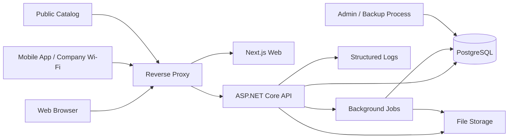

# Fabrika ERP-Lite
## Veritabanı Mimarisi ve Teknik Altyapı Ön Taslağı

**Durum:** Ön taslak — kodlama ve migration öncesi mimari çalışma  
**Dil:** Kullanıcı arayüzü Türkçe, kod/entity/property isimleri İngilizce  
**Temel yaklaşım:** Modüler monolith, ilişkisel veri modeli, PostgreSQL, merkezi şirket içi server

## 1. Mimari hedef

Sistem; üretim, depo, satış, sevkiyat, fatura, cari, ödeme ve personel modüllerinin aynı gerçek veri modelini kullanacağı merkezi bir uygulama olarak tasarlanacaktır. Aynı müşteri, ürün, sipariş, stok veya cari hareket farklı modüllerde tekrar oluşturulmayacak; ilişkiler foreign key, belge bağlantısı ve audit kayıtlarıyla izlenebilir olacaktır.

İlk sürümde mikroservis, Kafka veya Kubernetes gibi operasyonel karmaşıklığı artıran bileşenler kullanılmayacaktır. Uygulama modüler monolith biçiminde geliştirilecek, ileride yoğunluk artarsa modüllerin ayrıştırılmasına uygun sınırlar korunacaktır.

## 2. Önerilen teknik altyapı

| Katman | Öneri | Sorumluluk |
|---|---|---|
| Web frontend | React + TypeScript + Next.js | Masaüstü ve tablet ERP arayüzü |
| Mobil frontend | Flutter | Android/iOS operasyon uygulaması |
| Backend | ASP.NET Core Web API + C# | REST API, iş kuralları, auth ve entegrasyon |
| Domain | Domain/Application katmanları | İş kuralları ve kullanım senaryoları |
| ORM | Entity Framework Core | PostgreSQL erişimi, migration, transaction |
| Veritabanı | PostgreSQL | İlişkisel ana veri ve finans/stok kayıtları |
| Cache | İlk sürümde uygulama içi cache; ihtiyaçta Redis | Dashboard ve referans veri cache'i |
| Dosya depolama | Server filesystem veya S3 uyumlu storage | Ürün görseli, PDF, belge ve ek dosya |
| Kimlik | JWT access token + refresh token | Web/mobil kimlik doğrulama |
| Reverse proxy | Nginx veya Traefik | HTTPS, yönlendirme, statik içerik |
| Loglama | Serilog + structured logging | Uygulama, hata ve audit destek logları |
| Background jobs | ASP.NET Hosted Service / Hangfire benzeri yapı | Backup, bildirim, rapor ve bakım işleri |
| Container | Docker Compose | Backend, web, PostgreSQL, reverse proxy |
| İzleme | `/health` endpoint + log dosyaları | Servis ve database sağlık kontrolü |

## 3. Deployment topolojisi



Şirket içi kullanımda frontend ve API şirket server'ında çalışır. Mobil cihazlar şirket Wi-Fi ağı üzerinden API'ye erişir. Dış müşteriye açık public katalog ayrı bir route veya subdomain üzerinden aynı API'nin kontrollü public endpoint'lerini kullanır.

## 4. Veritabanı katmanları ve tablo grupları

### 4.1 Kimlik, yetki ve denetim

| Tablo | Ana alanlar |
|---|---|
| `users` | `id`, `username`, `email`, `password_hash`, `is_active`, `last_login_at` |
| `roles` | `id`, `code`, `name`, `description`, `is_active` |
| `permissions` | `id`, `code`, `module`, `action`, `description` |
| `user_roles` | `user_id`, `role_id`, `created_at` |
| `role_permissions` | `role_id`, `permission_id`, `effect` |
| `user_permission_overrides` | `user_id`, `permission_id`, `effect`, `reason` |
| `refresh_tokens` | `user_id`, `token_hash`, `expires_at`, `revoked_at`, `device_info` |
| `audit_logs` | `user_id`, `action`, `entity_type`, `entity_id`, `old_values`, `new_values`, `ip_address`, `created_at` |

`password_hash` dışında düz metin parola tutulmayacaktır. Refresh token değeri de mümkün olduğunca hash olarak saklanmalı; kullanıcı veya cihaz oturumu iptal edildiğinde token geçersizleştirilmelidir.

### 4.2 Müşteri ve ürün ana verisi

| Tablo | Ana ilişki |
|---|---|
| `customers` | Müşteri kartı; cari ve satış belgelerinin ana kaynağı |
| `customer_addresses` | Fatura, teslimat ve diğer adres tipleri |
| `customer_contacts` | Yetkili, telefon ve e-posta bilgileri |
| `customer_notes` | Kullanıcı notları ve operasyon notları |
| `product_categories` | Ürün sınıflandırması |
| `units_of_measure` | `Piece`, `Kilogram`, `Meter`, `Liter` gibi temel ölçü birimleri |
| `products` | Ürün kodu, ad, `base_uom_id`, fiyat ve minimum stok |
| `product_packagings` | Ürün bazlı palet/koli/paket dönüşüm hiyerarşisi ve satış birimleri |
| `product_barcodes` | Bir ürüne ve gerekirse ambalaj seviyesine bağlı barkod |
| `product_images` | Ürün görseli ve dosya metadata'sı |
| `product_prices` | Fiyat listesi, müşteri grubu veya geçerlilik dönemi |

Ürün kodu ve barkod benzersiz olmalıdır. Public katalog yalnızca `is_active = true` olan ve public görünürlüğü açık ürünleri döndürür. `product_packagings` aynı ürünün farklı ambalajlarını temsil eder; `5 Koli` için ayrı ürün kartı oluşturulmaz.

#### Ambalaj dönüşüm şeması

`product_packagings` için önerilen alanlar:

| Alan | Açıklama |
|---|---|
| `id`, `product_id` | Ambalaj kaydı ve bağlı ürün |
| `level` | `BaseUnit`, `Package`, `Case`, `Pallet` |
| `name` | Kullanıcı etiketi: `Adet`, `Paket`, `Koli`, `Palet` |
| `parent_packaging_id` | Bir üst ambalaj kaydı; örneğin Koli → Paket |
| `units_per_parent` | Üst seviyedeki alt ambalaj adedi |
| `quantity_in_base_uom` | Bir ambalajın temel ölçü birimindeki kesin karşılığı |
| `is_sellable`, `allow_partial` | Satış/sevk seçimi ve parçalı ambalaj izni |
| `effective_from`, `effective_to` | Dönüşüm değişikliklerinde versiyonlama |

Sipariş, irsaliye, stok hareketi, rezervasyon ve üretim kaydında aşağıdaki alanlar birlikte değerlendirilmelidir:

```text
entered_quantity          = Kullanıcının girdiği sayı, örn. 5
entered_packaging_id      = Koli
quantity_base              = Backend dönüşümü, örn. 10.000 adet
packaging_snapshot         = Belge tarihindeki ad, katsayı ve hiyerarşi
packaging_breakdown        = Gerekirse 4 Koli + 6 Paket gibi görünüm
```

`quantity_base` stok ve miktar doğruluğunun kaynağıdır. Ambalaj tanımı sonradan değişse bile belge üzerindeki `packaging_snapshot` geçmişteki `5 Koli (10.000 adet)` ifadesini korur.

### 4.3 Depo ve stok

| Tablo | Ana ilişki |
|---|---|
| `warehouses` | Depo ana kartı |
| `warehouse_locations` | Depo içi raf/konum |
| `stocks` | `product_id + warehouse_id + location_id` miktar özeti |
| `stock_movements` | Giriş, çıkış, transfer, sayım, iade ve düzeltme kayıtları; temel miktar ve ambalaj snapshot'ı |
| `stock_reservations` | Sipariş veya belge bazlı rezerve temel miktar |
| `stock_movement_packaging` | İsteğe bağlı hareket kırılımı: 5 Koli, 6 Paket gibi kapalı/parçalı ambalaj detayı |
| `stock_counts` | Sayım başlıkları |
| `stock_count_items` | Sistem, sayılan, fark ve gerekçe |
| `warehouse_transfers` | Kaynak/hedef depo transfer başlığı |
| `warehouse_transfer_items` | Transfer ürünleri ve miktarlar |

`stock_movements` silinemez ledger olarak tasarlanmalıdır. Hatalı hareket iptal veya ters hareketle düzeltilir. Tüm hareketler ürünün `base_uom` değerinde tutulur; kullanıcıya gösterilen koli/paket kırılımı ayrıca saklanır veya snapshot'tan yeniden üretilebilir. Kullanılabilir stok için temel hesap:

```text
AvailableBaseQuantity = OnHandBaseQuantity - ReservedBaseQuantity
```

Örnek: Ürünün bir kolisi 2.000 adet ise `5 Koli` çıkış hareketi `quantity_base = 10.000` olarak kaydedilir; arayüzde `5 Koli (10.000 adet)` gösterilir. `0,5 Koli` gibi belirsiz bir gösterim yerine parçalı ambalaj gerekiyorsa `10 Paket` veya `4 Koli + 6 Paket` kırılımı kullanılır.

İrsaliye kesinleştirme, üretim tamamlama, transfer ve sayım düzeltmesi transaction içinde hareket ve özet stok tablosunu birlikte güncellemelidir. Dönüşüm hesabı backend'de yapılmalı; frontend'den gelen `quantity_base` tek başına güvenilir kabul edilmemelidir.

### 4.4 Teklif, sipariş ve satış belgeleri

| Tablo | Ana ilişki |
|---|---|
| `quote_requests` | Public veya iç kaynaklı teklif talebi |
| `quote_request_items` | Talep edilen ürün, `entered_quantity`, `entered_packaging_id`, `quantity_base` |
| `quotes` | Teklif başlığı |
| `quote_items` | Teklif kalemi, girilen ambalaj, temel miktar, fiyat, iskonto, vergi ve snapshot |
| `sales_orders` | Tekliften veya iç kaynaktan oluşan sipariş |
| `sales_order_items` | Sipariş kalemi; ordered/reserved/shipped/remaining temel miktarları ve giriş ambalajı |
| `sales_order_approvals` | Onay kararı, açıklama, onaylayan kullanıcı |
| `delivery_notes` | İrsaliye başlığı |
| `delivery_note_items` | Sevk miktarı, barkod doğrulaması, `quantity_base` ve ambalaj görünümü |
| `shipments` | Araç, şoför, yükleme ve teslim durumu |
| `shipment_items` | İrsaliye/sevkiyat ürün bağlantısı |
| `invoices` | Fatura başlığı |
| `invoice_items` | Fatura kalemleri |

Belge bağlantıları doğrudan foreign key ile kurulmalıdır. Örnek ilişki:

```text
QuoteRequest
  → Quote
  → SalesOrder
  → DeliveryNote
  → Shipment
  → Invoice
  → CurrentTransaction
```

Her belge başlığında durum, belge numarası, oluşturma/değiştirme kullanıcıları, tarih ve gerekliyse iptal açıklaması bulunmalıdır.

### 4.5 Cari ve finans

| Tablo | Ana ilişki |
|---|---|
| `current_accounts` | Müşteri başına cari hesap özeti |
| `current_transactions` | Borç/alacak ledger hareketi |
| `payments` | Tahsilat veya ödeme kaydı |
| `payment_methods` | Nakit, havale, EFT, çek, senet, kredi kartı |
| `payment_allocations` | Ödemenin faturalara dağılımı |
| `risk_profiles` | Müşteri risk seviyesi ve skor özeti |
| `risk_calculation_runs` | Risk hesaplama zamanı ve kullanılan değerler |

`current_transactions` immutable finansal ledger mantığıyla ele alınmalıdır. Bakiye, geriye dönük silme veya sessiz güncelleme yerine yeni hareketler ve kontrollü ters kayıtlar üzerinden korunmalıdır.

Ödeme transaction'ı şunları birlikte yapmalıdır:

```text
Payment
+ CurrentTransaction
+ PaymentAllocation (varsa)
+ CurrentAccount balance update
+ AuditLog
+ Notification (gerekiyorsa)
```

### 4.6 Üretim ve makine

| Tablo | Ana ilişki |
|---|---|
| `production_orders` | Üretim iş emri başlığı |
| `production_order_items` | İleride çok ürünlü iş emrine açık kalmak için kalemler |
| `production_records` | Başlangıç, bitiş, miktar, fire ve duruş |
| `production_personnel` | Üretim kaydı ve personel bağlantısı |
| `production_materials` | Kullanılan malzeme ve miktar |
| `machines` | Makine kartı ve durumu |
| `machine_downtimes` | Duruş nedeni ve süresi |
| `production_quality_records` | Kalite, fire veya uygunsuzluk bilgileri |

Üretim tamamlanması transaction içinde üretim kaydını kapatmalı, makine istatistiklerini güncellemeli, üretim girişi `stock_movement` oluşturmalı ve iş emrinin durumunu değiştirmelidir.

### 4.7 Personel

| Tablo | Ana ilişki |
|---|---|
| `employees` | Personel ana kartı |
| `departments` | Departmanlar |
| `employee_departments` | Tarihçeli departman bağlantısı |
| `attendance_records` | Giriş, çıkış, çalışma süresi |
| `overtime_records` | Fazla mesai ve onay |
| `leave_types` | İzin türleri |
| `leave_requests` | İzin talebi ve onay akışı |
| `salary_records` | Dönem bazlı maaş özeti |
| `employee_documents` | İK dosyaları ve belgeler |

Maaş modülü bordro mevzuatı iddiasında bulunmayan, harici bordro sistemine aktarılabilir bir kayıt altyapısı olarak tasarlanmalıdır.

## 5. Ortak kolon standardı

Kritik transactional tablolar için aşağıdaki alanlar standartlaştırılmalıdır:

```text
id UUID veya BIGINT
created_at timestamptz not null
updated_at timestamptz not null
created_by UUID null
updated_by UUID null
is_deleted boolean default false  -- sadece soft delete uygun olanlarda
row_version veya xmin tabanlı concurrency kontrolü
```

Belge ve ledger tablolarında fiziksel silme yapılmamalıdır. Master data tablolarında soft delete veya pasifleştirme kullanılabilir.

## 6. Anahtar ve index önerileri

| Alan/ilişki | Index/constraint |
|---|---|
| Kullanıcı e-posta | `unique` case-insensitive index |
| Ürün kodu | `unique` |
| Ürün barkodu | `unique` aktif barkod constraint |
| Belge numarası | Belge tipi + dönem veya tam numara unique |
| Stok | Product + Warehouse + Location unique |
| Cari hareket | CurrentAccount + CreatedAt index |
| Stock movement | Product + Warehouse + CreatedAt index |
| Sipariş | Customer + Status + CreatedAt index |
| Fatura | Customer + DueDate + PaymentStatus index |
| Audit | EntityType + EntityId + CreatedAt index |
| Bildirim | RecipientUser + IsRead + CreatedAt index |
| Public talep | CreatedAt + Status index |

Büyük listeler için server-side pagination, projection ve tarih/tenant/warehouse filtrelerine uygun birleşik index'ler kullanılmalıdır. Sorgu planları örnek büyük veriyle test edilmelidir.

## 7. Transaction sınırları

### Sipariş onayı

```text
Begin transaction
→ approval kaydı
→ stok kullanılabilirlik kontrolü
→ stock reservation
→ order status update
→ audit log
→ notification
Commit
```

### İrsaliye kesinleştirme

```text
Begin transaction
→ delivery note issue
→ stock availability check
→ stock movement OUT
→ stock / reservation update
→ audit log
Commit
```

### Ödeme

```text
Begin transaction
→ payment create
→ current transaction
→ payment allocation
→ balance update
→ audit log
Commit
```

### Üretim tamamlama

```text
Begin transaction
→ production record close
→ production order status update
→ stock movement IN
→ machine statistics update
→ audit log
→ notification
Commit
```

## 8. API ve uygulama katmanı

Önerilen backend katmanları:

```text
API
  → Application
      → Domain
      → Infrastructure
      → Persistence
```

Controller katmanları yalnızca request/response, authorization ve application command/query çağrısını yönetmelidir. Domain kuralları controller içine gömülmemelidir. API response'larında entity doğrudan dönülmemeli; request/response DTO, validation ve standart hata modeli kullanılmalıdır.

Önerilen endpoint grupları:

```text
/api/auth
/api/users
/api/roles
/api/products
/api/customers
/api/quote-requests
/api/quotes
/api/orders
/api/delivery-notes
/api/shipments
/api/invoices
/api/current-accounts
/api/payments
/api/warehouses
/api/stocks
/api/production
/api/machines
/api/employees
/api/attendance
/api/leaves
/api/reports
/api/notifications
/api/audit
/api/system
```

## 9. Docker Compose servisleri

```yaml
services:
  reverse-proxy:
  web:
  api:
  postgres:
  backup:
```

İlk geliştirme ortamında `docker compose up` ile web, API ve PostgreSQL ayağa kalkmalıdır. Production ortamında environment secret'ları compose dosyasına düz metin yazılmamalı; volume, backup ve log klasörleri ayrıca tanımlanmalıdır.

## 10. Backup ve restore ön taslağı

Minimum gereksinimler günlük otomatik backup, retention policy, manuel backup ve restore dokümantasyonudur. Backup başarısız olursa admin bildirimi oluşturulmalıdır. Backup yalnızca oluşturulmuş sayılmamalı; periyodik restore testi ile gerçekten açılabildiği doğrulanmalıdır.

Önerilen ilk politika:

| Konu | Ön taslak |
|---|---|
| Frekans | Günlük full database backup |
| Saklama | En az son 14 günlük yedek |
| Dosya | Ayrı backup volume veya harici disk |
| Test | Aylık restore doğrulaması |
| Bildirim | Başarı/başarısızlık yönetici bildirimi |
| Güvenlik | Backup klasör erişimi kısıtlı ve şifreli |

## 11. Güvenlik ve operasyon gereksinimleri

JWT access token kısa ömürlü, refresh token iptal edilebilir olmalıdır. Parolalar güçlü hash algoritmasıyla saklanmalı; rate limiting, secure headers, input validation, dosya MIME/uzantı/boyut kontrolü, CSRF gereken endpointlerde koruma, audit ve session invalidation uygulanmalıdır.

Finansal ve stok kayıtları fiziksel olarak silinmemeli; kritik işlem yapan kullanıcının kimliği, zamanı, IP bilgisi, eski ve yeni değerleri loglanmalıdır. Mobil uygulama ağ kesintisinde finansal veya stok işlemini offline kuyruğa alıp sessizce göndermemelidir.

## 12. Ön taslakta kesinleştirilecek kararlar

| Karar | Öneri |
|---|---|
| Primary key | Dağıtık mobil/API senaryolarına açık UUID; belge no ayrı okunabilir sequence |
| Multi-company | İlk sürüm tek şirket; `company_id` için ileride genişletilebilir sınır |
| Multi-warehouse | İlk sürümden desteklenmeli |
| Para | TRY, finansal alanlarda decimal/numeric |
| Tarih | Database UTC, UI Türkiye yerel zamanı |
| Soft delete | Master data için; ledger ve belge için iptal/ters kayıt |
| Concurrency | Row version veya PostgreSQL concurrency kontrolü |
| Dosya | Metadata DB, dosya filesystem veya S3 uyumlu storage |
| Rapor | Read model/projection ve server-side filtre |

## 13. Karar bağımlı şema ve deployment genişlemeleri

Aşağıdaki maddeler `/design/open-decisions-solution-matrix.md` içindeki öneriler seçildiğinde migration ve API tasarımına yansıtılır. Önerinin bulunması, seçimin yapılmış olduğu anlamına gelmez.

| Karar | Şema/API etkisi | Gate koşulu |
|---|---|---|
| O-002 Kısmi sevkiyat | `SalesOrderItem` üzerinde ordered/reserved/shipped/remaining miktarları; bir siparişten birden fazla `DeliveryNote` | Domain, workflow, screen inventory ve allocation testleri birlikte güncellenmiş olmalı |
| O-003 Kısmi fatura | `InvoiceItem`–`DeliveryNoteItem` allocation; invoiced/remaining miktarları; duplicate allocation constraint/idempotency | Fatura toplamı sevk edilenden ve kalan miktardan büyük olamaz |
| O-012 Fiyat listesi | `PriceList`, `CustomerPriceGroup`, `ProductPrice` geçerlilik ve sipariş/teklif fiyat snapshot | Fiyat yetkileri ve public fiyat gizliliği doğrulanmalı |
| O-004 BOM | `ProductionMaterial` ve hammadde `StockMovement OUT`; MVP’de kapalıysa tablolar ilk migration’a girmez | Üretim maliyet ve stok etkisi seçilmeli |
| O-005 Lot/seri | Lot/serial master, movement bağlantısı ve traceability index’leri; MVP’de kapalıysa kapsam dışı | Kalite/iade/mevzuat sahibi kararı gerekli |
| O-001 e-Belge | Vergi alanları + `IInvoiceIntegrationService` adapter/stub; gerçek sağlayıcı entegrasyonu ayrı | Mali müşavir ve entegrasyon sahibi onayı gerekli |
| O-010/O-011 Operasyon | Backup job/retention/restore runbook; Docker Compose, reverse proxy, HTTPS ve health-check seçimi | RPO/RTO, OS, LAN ve sertifika kararı yazılı olmalı |

## 14. Kodlama öncesi çıkış kriteri

Bu ön taslak; migration yazmadan önce entity ilişkilerinin, belge yaşam döngülerinin, transaction sınırlarının, permission modelinin ve deployment bileşenlerinin gözden geçirilmesi için kullanılmalıdır. Proje yönetimi ekibinin özellikle sipariş onayı, irsaliye stok çıkışı, ödeme-cari hareket ve üretim-stok girişi işlemlerini onaylamasından sonra şema detaylandırılıp migration planına geçilmelidir.
