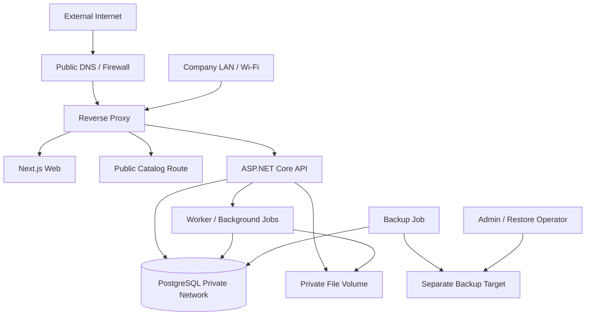

# Factory ERP — Docker Compose ve PostgreSQL Deployment Planı

**Aşama:** ARCHITECTURE

**Durum:** O-010/O-011 kararlarına göre kabul edilmiş deployment baseline; production runbook ve compose dosyası değildir.

**Kapsam:** Şirket içi local-first server, web, mobil LAN erişimi, public katalog route’u, PostgreSQL, backup/restore, HTTPS, health check ve operasyon sınırları.

## 1. Deployment baseline

O-011 gereği ilk deployment Ubuntu LTS üzerinde Docker Compose ile çalışır. PostgreSQL, ASP.NET Core API, Next.js web, reverse proxy ve backup job aynı şirket server’ında bulunabilir; internal API route’ları public internet’e açılmaz. Mobil cihazlar şirket Wi-Fi veya kontrollü LAN üzerinden reverse proxy’ye erişir.

O-010 gereği günlük full PostgreSQL backup, ayrı backup hedefi, 14 günlük retention ve aylık restore testi uygulanır. Başlangıç hedefleri `RPO ≤ 24 saat` ve `RTO ≤ 8 saat`tir. Bu hedefler production acceptance testinde ölçülür; sağlanmadığında deployment operasyonel olarak kabul edilmiş sayılmaz.

## 2. Topoloji



Reverse proxy dışarıya yalnızca public katalog route’unu ve gerekiyorsa şirket dışı güvenli erişim route’unu açar. PostgreSQL portu host üzerinde public bind edilmez. API’nin internal admin, reporting, payroll ve current-account endpoint’leri public route allowlist’ine alınmaz.

## 3. Compose servisleri

| Service | Image/build | Network | Persistent volume | Sorumluluk |
|---|---|---|---|---|
| `reverse-proxy` | Nginx veya Traefik | `edge`, `internal` | TLS/certificate volume | HTTPS termination, route ve headers |
| `web` | Next.js image | `internal` | Yok veya build asset | Web ERP UI |
| `api` | ASP.NET Core image | `internal`, `data` | File metadata dışında yok | REST API ve business commands |
| `postgres` | PostgreSQL pinned major | `data` | `postgres_data` | Ana relational database |
| `worker` | ASP.NET worker image | `internal`, `data` | Job state metadata | Notification, report, backup orchestration |
| `backup` | PostgreSQL client + backup script | `data`, `backup` | `backup_data` veya NAS mount | Dump, verify, retention, restore helper |

İlk MVP’de `worker` API içinde Hosted Service olarak başlayabilir; backup gibi kritik işlemler ayrı container veya host scheduler ile izole edilmelidir. `backup` servisi uygulama API credential’larını kullanmaz; yalnızca PostgreSQL backup role veya controlled socket erişimi kullanır.

## 4. Compose network ve port politikası

```yaml
networks:
  edge:
    internal: false
  internal:
    internal: true
  data:
    internal: true
  backup:
    internal: true
```

Önerilen host portları yalnızca reverse proxy için bind edilir:

```text
80/tcp   → reverse-proxy redirect veya LAN HTTP bootstrap
443/tcp  → reverse-proxy HTTPS
5432/tcp → host bind edilmez; yalnızca data network
3000/tcp → host bind edilmez; reverse-proxy üzerinden web
8080/tcp → host bind edilmez; reverse-proxy üzerinden API
```

Development profile’da PostgreSQL için loopback bind geçici olarak kullanılabilir; şirket LAN veya public interface üzerine `5432` açılmaz. Production Compose dosyası development port mapping’lerini içermemelidir.

## 5. Environment ve secret yönetimi

Repository’ye gerçek secret, parola, private key veya refresh token yazılmaz. Deployment host’ta dosya permission’ları kısıtlı environment veya Docker secret yaklaşımı kullanılır.

```text
APP_ENVIRONMENT=Production
POSTGRES_DB=factory_erp
POSTGRES_USER=factory_erp_app
POSTGRES_PASSWORD=<secret-store>
POSTGRES_HOST=postgres
JWT_ISSUER=https://erp.example.local
JWT_SIGNING_KEY=<secret-store>
PUBLIC_CATALOG_BASE_URL=https://catalog.example.local
FILES_ROOT=/var/lib/factory-erp/files
BACKUP_ROOT=/var/backups/factory-erp
DEFAULT_TIMEZONE=Europe/Istanbul
```

Ayrı roller önerilir:

| Role | Yetki |
|---|---|
| `factory_erp_app` | Uygulama schema/table CRUD; migration privilege production’da sınırlı |
| `factory_erp_migrator` | Migration sırasında DDL; sürekli API connection string’de kullanılmaz |
| `factory_erp_backup` | Read/backup privilege; business write yok |
| `factory_erp_restore` | Yalnızca restore prosedüründe kontrollü kullanım |

## 6. PostgreSQL runtime ayarları

PostgreSQL sürümü major tag ile pinlenir; `latest` kullanılmaz. Database volume named volume veya işletim sistemi üzerinde açıkça yedeklenen directory olmalıdır. `shared_buffers`, connection limit ve WAL ayarları host RAM/disk ölçümü sonrası belirlenir; rastgele production değeri yazılmaz.

Minimum runtime kontrolleri:

```text
- UTF-8 database encoding
- Europe/Istanbul UI timezone; database timestamp UTC
- WAL ve checkpoint log erişimi
- Connection pool limitlerinin API replica sayısıyla uyumu
- Statement timeout ve idle transaction timeout politikası
- Disk free-space alert
- Autovacuum aktif
- Backup role ve restore test kullanıcıları ayrılmış
```

Database health check yalnızca TCP bağlantısı değil, basit authenticated query ve migration/schema version kontrolünü de içermelidir.

## 7. Health check ve dependency startup

Container `depends_on` tek başına uygulamanın hazır olduğunu garanti etmez. API startup sırasında PostgreSQL health check, schema version ve required seed kontrolü yapar. Migration üretimde otomatik olarak uygulama startup’ında çalıştırılmaz; kontrollü migration job veya release adımı kullanılır.

```text
postgres healthy
→ migration job approved/applied
→ seed version verified
→ api healthy
→ web ready
→ reverse-proxy route smoke test
→ mobile LAN smoke test
```

Önerilen endpoint’ler:

| Endpoint | Kontrol |
|---|---|
| `/health/live` | Process ayakta mı |
| `/health/ready` | DB, required config, schema version ve dependency hazır mı |
| `/health/startup` | İlk startup ve migration prerequisite |
| `/api/v1/system/health` | Authenticated operasyonel detay; public route’a kapalı |

Health response’ları password, connection string veya stack trace döndürmez.

## 8. Reverse proxy ve HTTPS

Reverse proxy şu görevleri üstlenir:

- HTTP’den HTTPS’e redirect.
- TLS certificate ve private key’i yalnızca proxy container’ın okuyabilmesi.
- HSTS, X-Content-Type-Options, frame/CORS ve request size header’ları.
- `/` web route’u, `/api/v1` API route’u ve `/catalog` public route’u.
- Public endpoint rate limit ve body size kontrolü.
- Internal admin/API endpoint’lerini public route’a proxy etmemek.
- Upload ve export response’ları için güvenli content disposition.

LAN-only erişimde internal DNS veya host entry kullanılabilir. Sertifika modeli self-signed internal CA veya yönetimce seçilmiş trusted certificate olabilir; mobile cihazların trust store kurulumu deployment acceptance testinde doğrulanır.

## 9. Backup ve restore planı

### 9.1 Backup işi

```text
Günlük cron/worker trigger
→ PostgreSQL consistent full dump veya base backup
→ gzip/zstd compression
→ checksum üret
→ backup hedefe yaz
→ archive restore metadata kaydı
→ retention purge
→ verify notification
```

Backup dosyaları aynı PostgreSQL volume’unda tutulmaz. En az ayrı disk/NAS hedefi bulunur. Mümkünse periyodik olarak offline veya başka makineye kopyalanır. Backup hedefi erişilemiyorsa job başarısız olur ve yöneticiye bildirim gönderir; sessiz başarı yazılmaz.

### 9.2 Restore testi

Aylık restore testi izole PostgreSQL container/host üzerinde yapılır:

```text
Backup seç
→ checksum verify
→ temporary database oluştur
→ restore
→ schema/migration version kontrolü
→ kritik aggregate count ve sample query
→ application read-only smoke test
→ sonuç, süre ve kullanılan backup kaydı
→ temporary database temizliği
```

Restore acceptance ölçütleri:

| Ölçüt | Hedef |
|---|---:|
| Backup bulunabilirlik | Son 14 günün her günü için en az bir doğrulanmış dosya |
| Restore başarı oranı | Aylık testte başarılı |
| RPO | En fazla 24 saat veri kaybı |
| RTO | En fazla 8 saat içinde servis kullanılabilirliği |
| Veri bütünlüğü | Allocation, stock ledger, current ledger ve audit sorguları başarılı |
| Bildirim | Başarı/başarısızlık yöneticilere iletilmiş |

## 10. Loglama ve izleme

Structured log alanları en az `timestamp`, `level`, `service`, `environment`, `requestId`, `correlationId`, `userId`, `route`, `statusCode`, `durationMs`, `errorCode` ve `entityId` içermelidir. Access log’da JWT, password, refresh token, kişisel maaş alanı veya full request body tutulmaz.

Alarm koşulları:

```text
- PostgreSQL unhealthy
- Disk free space threshold altında
- Backup başarısız veya checksum mismatch
- Restore test timeout/failure
- API 5xx oranı eşik üzerinde
- Public rate-limit ihlali artışı
- Migration/schema version mismatch
- TLS certificate expiry yaklaşması
- Queue/worker birikmesi
```

## 11. Deployment release prosedürü

```text
1. Git commit/tag ve migration manifest doğrula.
2. Backup başarı durumunu kontrol et.
3. Staging veya restore edilmiş test database’inde migration çalıştır.
4. Schema, constraint, index ve seed acceptance testlerini çalıştır.
5. Docker images digest/tag ile çek.
6. Migration job’ı kontrollü çalıştır.
7. API ve worker deploy et.
8. Web ve reverse proxy deploy et.
9. Health/ready, login, public catalog ve mobile LAN smoke testlerini çalıştır.
10. Backup job ve alert durumunu doğrula.
11. Release evidence ve rollback kararını kaydet.
```

Migration başarısızsa API yeni schema ile başlamaz. Destructive migration production’da otomatik rollback yapılmaz; backup restore veya forward-fix migration kullanılır. Uygulama image’ı önceki uyumlu schema ile çalışamıyorsa release durdurulur.

## 12. Kabul kriterleri

Architecture/Operations acceptance için aşağıdaki kanıtlar gerekir:

| Alan | Kanıt |
|---|---|
| Compose | Temiz host’ta `web`, `api`, `postgres`, `reverse-proxy`, worker/backup profili ayağa kalkıyor |
| Network | PostgreSQL public interface’e açık değil; public route internal DTO döndürmüyor |
| Migration | 0001–0018 temiz database’de sırayla başarılı |
| Seed | İkinci çalıştırma duplicate üretmiyor |
| HTTPS | LAN cihazı trusted HTTPS ile web ve mobile API’ye erişiyor |
| Health | live/ready/startup endpoint’leri beklenen sonucu döndürüyor |
| Backup | Günlük dump üretiliyor, checksum saklanıyor, retention çalışıyor |
| Restore | Aylık prosedür izole ortamda başarılı ve süre ölçülmüş |
| Security | Secret repository’de değil; non-root container ve restricted volume uygulanmış |
| Observability | API/database/backup hata bildirimi çalışıyor |

Bu belge Docker Compose ve operasyon architecture planıdır. Gerçek `compose.yaml`, reverse-proxy config, backup script ve deployment runbook Architecture acceptance sonrasında implementation repository’sinde üretilecektir.


## 12. Accepted Architecture ADR overlay

ADR-006/ADR-008 require the `worker` service to process committed `outbox_messages` after the API transaction completes. External notifications, report jobs and adapter calls are not executed inside API request transactions. The worker must expose queue/backlog health without exposing message payloads or secrets.

ADR-004 requires the API and database deployment to preserve the `row_version`/ETag contract. PostgreSQL update triggers and migration version checks are part of deployment acceptance. The `factory_erp_migrator` role is separate from the API role and is used only by the controlled migration job.

ADR-010 requires production deployment to use a private protected self-hosted runner or an internal pull/release mechanism. PR code is never run on the production runner. The production runner belongs to a restricted runner group, uses environment approval and has only the minimum PostgreSQL/Compose access required for release and backup jobs.

Before each release, the pipeline checks backup freshness, migration compatibility, image digest, schema version, health endpoints and outbox worker readiness. Rollback is image rollback plus forward-fix or restore; destructive database migration is not automatically reversed.
