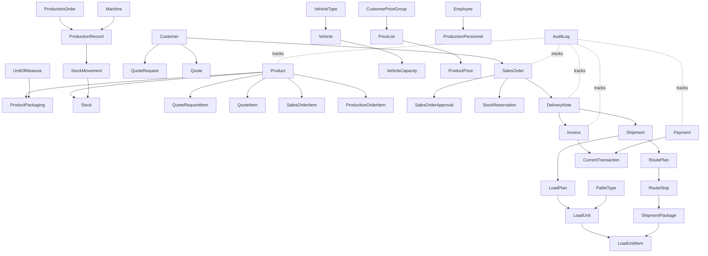

# Factory ERP — Domain Model ve Source of Truth

## 1. Bounded context haritası

| Bounded context | Ana kavramlar | Sahip olduğu davranış |
|---|---|---|
| Identity & Access | User, Role, Permission, Session | Kimlik, RBAC, oturum ve erişim |
| Products | Product, Category, UnitOfMeasure, ProductPackaging, ProductBarcode, ProductImage, ProductPrice, PriceList, CustomerPriceGroup | Ürün ana verisi, palet-koli-paket hiyerarşisi, katalog görünürlüğü ve karar verilirse müşteri bazlı fiyatlandırma |
| Customers | Customer, Address, Contact, Note | Müşteri kimliği, iletişim ve adres |
| Sales | QuoteRequest, Quote, SalesOrder, Approval | Talep, teklif, sipariş ve onay |
| Warehouse | Warehouse, Location, Stock, StockMovement, Reservation, Count, Transfer | Fiziksel stok ve depo hareketleri |
| Shipping | DeliveryNote, Shipment, VehicleType, Vehicle, Driver, RoutePlan, RouteStop, PalletType, LoadPlan, LoadUnit, LoadUnitItem, ShipmentPackage, VehicleCapacity | Sevk belgesi, araç/kargo kapasitesi, rota/durak, müşteri teslimatı, paket izleme, tekli veya karışık palet yükleme ve teslim |
| Invoicing | Invoice, InvoiceItem | Fatura ve belge bağlantıları |
| Current Accounts | CurrentAccount, CurrentTransaction | Borç, alacak, bakiye ve ekstre |
| Payments | Payment, PaymentMethod, PaymentAllocation | Tahsilat/ödeme ve fatura dağılımı |
| Production | ProductionPlan, ProductionOrder, ProductionRecord, Scrap, Downtime | Üretim planı, gerçekleşme ve kalite etkisi |
| Machines | Machine, MachineDowntime | Makine durumu, atama ve performans |
| Employees | Employee, Department, Attendance, Leave, Overtime, SalaryRecord | Personel ve çalışma kayıtları |
| Reporting | ReportQuery, ReportProjection | Yetkili rapor sorguları ve dışa aktarma |
| Notifications | Notification, Recipient, Preference | Hedefli sistem bildirimleri |
| Audit | AuditLog | Kritik işlemlerin değişmez geçmişi |
| File Storage | File, FileReference | Görsel ve belge metadata'sı |
| System Settings | SystemSetting, DocumentSequence | Şirket ve numaralandırma ayarları |

## 2. Source of truth matrisi

| Kavram | Tek kaynak | Türetilen / okuma modeli | Kopyalanmaması gereken alan |
|---|---|---|---|
| Ürün | `Product` + `UnitOfMeasure` + `ProductPackaging` | Public product card, stock lookup, packaging breakdown | Ürün adı/kodu, temel birim veya ambalaj dönüşümü başka modülde tekrar edilmemeli |
| Fiyat politikası | `PriceList` + `CustomerPriceGroup` (O-012 seçilirse) | Quote/Order price snapshot | Fiyat, sipariş veya ürün ekranlarında sessizce çoğaltılmamalı |
| Barkod | `ProductBarcode` | Barcode scanner result | Barkod ürün ve stoktan bağımsız tutulmamalı |
| Stok | `Stock` + `StockMovement` | Dashboard KPI, warehouse view | Mevcut miktar UI state olarak saklanmamalı |
| Rezervasyon | `StockReservation` | Available quantity | Sipariş kaleminde bağımsız rezerve miktar tutulmamalı |
| Müşteri | `Customer` | Sales, public request candidate, current account view | Firma adı müşteri dışında kanonik kopyalanmamalı |
| Cari | `CurrentTransaction` | Current balance, statement | Bakiye elle kaydedilen tek doğruluk kaynağı olmamalı |
| Ödeme | `Payment` + allocation | Payment status | Ödeme fatura satırında bağımsız hareket olarak tutulmamalı |
| Teklif | `Quote` | Quote PDF, quote summary | Sipariş fiyatı tekliften sessizce kopyalanmamalı |
| Sipariş | `SalesOrder` | Approval panel, picking list | Sevk belgesi sipariş yerine geçmemeli |
| İrsaliye | `DeliveryNote` | Shipment picking view | Sevkiyat miktarı irsaliyeden bağımsızlaşmamalı |
| Sevkiyat | `Shipment` + `RoutePlan` + `RouteStop` + `LoadPlan` + `LoadUnit` + `ShipmentPackage` | Delivery status, route board, capacity utilization, recipient tracking | Araç durumu, rota veya paket durumu sevkiyat miktarının yerine geçmemeli; her yükün müşteri/adres bağlantısı korunmalı |
| Fatura | `Invoice` | Customer balance, payment status | Cari hareket faturanın yerine geçmemeli |
| Üretim | `ProductionRecord` | Production dashboard, machine report | Dashboard toplamı ana kayıt yerine geçmemeli |
| Makine | `Machine` | Machine status board | İş emrinde makine adı metin olarak kopyalanmamalı |
| Personel | `Employee` | Attendance, production assignment, HR report | Üretim kaydında personel adı serbest metin olmamalı |
| Audit | `AuditLog` | Activity timeline | Aktivite ekranı audit yerine geçmemeli |

## 3. Ana ilişkiler



## 4. Entity ve belge sınırları

Bir ekranın başka bir context'in verisini göstermek için read model veya kontrollü application query kullanması gerekir. Başka context'in entity'sini sahiplenerek güncellememelidir. Örneğin depo sevkiyat hazırlarken `SalesOrder` durumunu doğrudan değiştirmez; sevk gerçekleşmesi `DeliveryNote` ve `Shipment` use-case'leri üzerinden sipariş durumunu etkiler.

Belge zinciri şu şekilde ilerler:

```text
QuoteRequest
  → Quote
  → SalesOrder
  → SalesOrderApproval
  → StockReservation
  → DeliveryNote
  → Shipment
  → Invoice
  → CurrentTransaction
  → Payment
```

Üretim zinciri:

```text
ProductionPlan
  → ProductionOrder
  → MachineAssignment
  → PersonnelAssignment
  → ProductionRecord
  → Scrap / Downtime
  → StockMovement(ProductionReceipt)
```

## 5. Domain invariant özeti

- Onaylanmamış veya iptal edilmiş sipariş irsaliyeye dönüşemez.
- Sevk miktarı kullanılabilir stoktan büyük olamaz.
- Aynı irsaliye kalemi için faturalandırılan toplam miktar, sevk edilen ve faturalanmamış kalan miktarı aşamaz; aynı allocation ikinci kez uygulanamaz.
- İptal edilmiş belge tekrar aktif duruma dönemez; reversal oluşturulur.
- Stok miktarı yalnızca StockMovement veya rezervasyon use-case'i ile değişebilir.
- Cari bakiye transaction hareketlerinin sonucudur.
- Aynı ödeme idempotency/reference kontrolü olmadan ikinci kez uygulanamaz.
- Üretim tamamlanması, üretim girişinin ve audit kaydının sonucuyla birlikte tamamlanmış sayılır.
- Yetkisiz state transition backend tarafından reddedilir.
- Kritik state transition'lar AuditLog oluşturur.

## 6. Ambalaj ve miktar hiyerarşisi

Ürün miktarı tek bir serbest metin veya tek bir `unit` alanıyla tutulmaz. Her ürün için temel ölçü birimi ve buna bağlı ambalaj seviyeleri tanımlanır. Önerilen hiyerarşi:

```text
Palet
  └─ Koli
      └─ Paket
          └─ Temel Birim (adet, kg, metre, litre vb.)
```

`ProductPackaging` ürünün ambalaj tanımını, `UnitOfMeasure` ise ölçü tipini temsil eder. Aynı fiziksel ürün için farklı ambalajlar ayrı ürün kartı değildir; aynı `Product` altında tanımlı paketleme seviyeleridir.

| Alan | Anlam |
|---|---|
| `Product.base_uom_id` | Stok ledger'ının temel ölçü birimi; örneğin `Adet` veya `kg` |
| `ProductPackaging.level` | `BaseUnit`, `Package`, `Case`, `Pallet` gibi seviye |
| `ProductPackaging.name` | Kullanıcıya gösterilen ad; `Paket`, `Koli`, `Palet` |
| `ProductPackaging.parent_packaging_id` | Bir üst ambalajın alt ambalajı; örneğin Koli → Paket |
| `ProductPackaging.units_per_parent` | Üst ambalajda kaç alt ambalaj olduğu |
| `ProductPackaging.quantity_in_base_uom` | Bir ambalajın temel birimdeki kesin karşılığı |
| `ProductPackaging.barcode` | O ambalaj seviyesine ait barkod; varsa `ProductBarcode` üzerinden yönetilir |
| `ProductPackaging.is_sellable` | Teklif/sipariş/sevkiyat ekranında seçilebilir mi |
| `ProductPackaging.allow_partial` | Ambalajın açılmış/parçalı olarak işlem görmesine izin var mı |

### Örnek: 5 koli ürünün tarifi

Örneğin bir peçete ürünü için aşağıdaki tanımlar yapılmış olsun:

| Seviye | Tanım | Temel birim karşılığı |
|---|---:|---:|
| Temel birim | 1 adet | 1 adet |
| Paket | 100 adet | 100 adet |
| Koli | 20 paket | 2.000 adet |
| Palet | 40 koli | 80.000 adet |

Bu durumda kullanıcı **5 koli** seçtiğinde yeni bir ürün veya `5 Koli` isimli ayrı stok kartı açılmaz. İşlem şu şekilde kaydedilir:

```text
Product: Premium Napkin 33x33
Girilen miktar: 5
Girilen ambalaj: Koli
Temel birim miktarı: 5 × 2.000 = 10.000 adet
Ekran özeti: 5 Koli (10.000 adet)
```

Ürün ağırlıkla yönetiliyorsa aynı model geçerlidir. Örneğin bir koli 60 kg ise `5 Koli` işlemi `300 kg` temel miktar olarak ledger'a yazılır. **Stok, rezervasyon, sevkiyat, fatura allocation ve üretim hareketlerinde kaynak doğruluk temel birim miktarıdır; kullanıcı girişi ve belge görünümü ambalaj birimiyle birlikte saklanır.**

### Karma ve parçalı ambalaj

Açılmış kolilerde kullanıcıya yalnızca ondalıklı koli göstermek yerine açık bir kırılım gösterilir:

```text
4 Koli + 6 Paket = 8.600 adet
```

Bu değerlerin toplamı yine temel birimde tutulur. `quantity_base` doğruluk kaynağıdır; `entered_quantity`, `entered_packaging_id` ve ambalaj snapshot'ı ise kullanıcının işlemi nasıl girdiğini ve belge üzerinde nasıl gösterileceğini korur. Ambalaj tanımı sonradan değişse bile geçmiş belge `5 Koli (10.000 adet)` olarak bozulmadan görüntülenir.

### Miktar invariants

- Her ürünün tek bir `base_uom` değeri vardır; stok ledger'ı bu birim üzerinden tutulur.
- Ambalaj dönüşüm katsayısı ürün bazlıdır; global `1 koli = X` varsayımı yapılmaz.
- `quantity_base = entered_quantity × packaging.quantity_in_base_uom` dönüşümü backend'de yapılır ve frontend'e güvenilmez.
- Kapalı koli/paket hareketleri yalnızca tam sayı adet kabul eder; parçalı işlem yalnızca `allow_partial = true` olan seviyelerde açılır.
- Farklı ambalaj seviyelerine ait barkodlar aynı ürüne bağlanır; barkodun hangi ambalajı temsil ettiği kaybolmaz.
- Ambalaj tanımı değişirse yeni effective-from sürümleme veya yeni packaging kaydı oluşturulur; geçmiş stok ve belgeler geriye dönük yeniden yorumlanmaz.
- Kullanılabilir stok hesabı temel birimde yapılır: `AvailableBaseQuantity = OnHandBaseQuantity - ReservedBaseQuantity`.

## 7. Karar bağımlı genişlemeler

Aşağıdaki model genişlemeleri `/design/open-decisions-solution-matrix.md` içindeki öneriler seçildiğinde etkinleştirilir; karar sahibi onayı olmadan baseline entity veya state olarak kabul edilmez:

| Karar | Domain etkisi |
|---|---|
| O-002 Kısmi sevkiyat | `SalesOrderItem` için ordered/shipped/remaining miktarları, bir siparişten birden fazla `DeliveryNote` |
| O-003 Kısmi fatura | `InvoiceItem` ile sevk/irsaliye kalemi allocation'ı, invoiced/remaining miktarları ve miktar sınırı |
| O-012 Fiyat listesi | `PriceList`, `CustomerPriceGroup`, geçerlilik ve order/quote price snapshot |
| O-004 BOM | `ProductionMaterial` ve hammadde hareketleri; MVP kapalı tutulursa migration dışı |
| O-005 Lot/seri | `Lot`/`SerialNumber`, son kullanma ve traceability; MVP kapalı tutulursa migration dışı |

## 8. Fiziksel lojistik ve karışık palet domain modeli

Ambalaj miktarı ile fiziksel yükleme farklı sorumluluklardır. `5 Koli` ürün miktarını ifade eder; koli boyutu, brüt ağırlığı, hacmi ve hangi palete yerleştirildiği `Shipping` bounded context'inde yönetilir.

| Entity | Sorumluluk |
|---|---|
| `ProductPhysicalProfile` | Temel ürün ölçüsü, net ağırlığı, hacmi, kırılabilirlik ve taşıma kuralları |
| `PackagingPhysicalProfile` | Kutu/koli/paket/palet dış ölçüsü, dara, brüt ağırlık ve istifleme kuralları |
| `PalletType` | Palet ölçüsü, dara ağırlığı, maksimum yük ve istifleme sınırı |
| `VehicleCapacity` | Araç/kargo tipi için maksimum ağırlık, hacim, palet ve ölçü kapasitesi |
| `LoadPlan` | Bir shipment için taslak, doğrulanmış veya kilitlenmiş yükleme planı |
| `LoadUnit` | Palet, kafes, koli grubu veya loose yük birimi; karışık palet olabilir |
| `LoadUnitItem` | LoadUnit içindeki ürün, ambalaj seviyesi, temel miktar ve fiziksel değerler |
| `VehicleType` | Kamyonet, kamyon, panelvan, tır vb. tipin kapasite ve ölçü şablonu |
| `Vehicle` | Gerçek araç, plaka, tip, aktiflik ve mevcut sevkiyat durumu |
| `VehicleCapacity` | Araç/taşıyıcı için kg, m³, palet, ölçü ve istifleme sınırları |
| `RoutePlan` | Sevkiyatın durak sırası, toplam rota ve planlanan zamanları |
| `RouteStop` | Bir müşteri teslimat adresi, sıra, planlanan/gerçekleşen zaman ve durum |
| `ShipmentPackage` | Koli/paket/palet veya yük biriminin hangi müşteriye/adrese gittiğini ve izleme durumunu taşıyan sevkiyat birimi |

`LoadUnit` tek bir ürün kartı değildir. Karışık palet şu şekilde modellenir:

```text
Shipment
  → LoadPlan
      → LoadUnit(Pallet-001, Mixed)
          → LoadUnitItem(Product A, 3 Koli)
          → LoadUnitItem(Product B, 6 Koli)
```

### Fiziksel lojistik invariants

- Yük planı `Shipment` miktarını artıramaz; her `LoadUnitItem` bağlı irsaliye/sevkiyat kaleminin kalan miktarını aşamaz.
- Palet uygunluğu ağırlık, hacim, palet ölçüsü, maksimum yük, istifleme ve ürün uyumluluğu kontrollerinin tamamından geçmelidir.
- `is_stackable = false` veya `max_stack_count = 1` olan yüklerin üzerine başka yük konulamaz.
- Karışık palet aynı palet üzerinde birden fazla ürün veya ambalaj seviyesine izin verir; fiziksel uyumsuzluk varsa sistem engeller veya yetkili override ister.
- Taslak yük planı sevkiyatı değiştirmez. `Locked` durumuna gelen plan audit kaydı üretir; gerçek yükleme ayrıca barkodla doğrulanır.
- Planlanan ve gerçekleşen yük farkı açıklama ve gerekirse yetkili onayı gerektirir.
- Her `ShipmentPackage` en az bir `RouteStop` ve teslimat adresiyle ilişkilidir; bir karışık palet üzerinde farklı müşterilere giden paketler bulunabilir, ancak barkod ve paket içeriğiyle ayrıştırılabilir olmalıdır.
- `Vehicle` aynı anda kapasitesi uygun birden fazla sevkiyat taşıyabilir; her sevkiyat ve durak için yük dağılımı izlenebilir olmalıdır.
- Araç ana durumu ile sevkiyat durumu ayrı tutulur. Araç `Available`, `Assigned`, `Loading`, `InTransit`, `Maintenance` olabilir; sevkiyat `Preparing`, `Loaded`, `InTransit`, `PartiallyDelivered`, `Delivered`, `Exception` olabilir.
- Bir durakta teslim edilen paketler, diğer durakların kalan yükünden ayrıştırılır; teslimat kanıtı ve teslim alan kişi route stop üzerinde tutulur.

## 9. Tasarım sonucu

Source of truth haritası `/design` altındaki canonical ekran, workflow ve teknik dokümanların ortak referansıdır. Numaralı `docs/00`–`docs/06` dosyaları senkronize arşiv olarak korunur. Aynı kavram için farklı modüllerde ikinci bir ana kayıt tasarlanırsa bu durum `/design/decision-log.md` içinde açıkça değerlendirilmeden Design Gate geçilmez.
