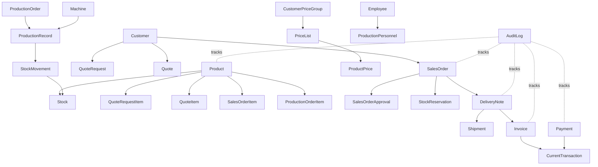

# Factory ERP — Domain Model ve Source of Truth

## 1. Bounded context haritası

| Bounded context | Ana kavramlar | Sahip olduğu davranış |
|---|---|---|
| Identity & Access | User, Role, Permission, Session | Kimlik, RBAC, oturum ve erişim |
| Products | Product, Category, ProductBarcode, ProductImage, ProductPrice, PriceList, CustomerPriceGroup | Ürün ana verisi, katalog görünürlüğü ve karar verilirse müşteri bazlı fiyatlandırma |
| Customers | Customer, Address, Contact, Note | Müşteri kimliği, iletişim ve adres |
| Sales | QuoteRequest, Quote, SalesOrder, Approval | Talep, teklif, sipariş ve onay |
| Warehouse | Warehouse, Location, Stock, StockMovement, Reservation, Count, Transfer | Fiziksel stok ve depo hareketleri |
| Shipping | DeliveryNote, Shipment, Vehicle, Driver | Sevk belgesi, yükleme ve teslim |
| Invoicing | Invoice, InvoiceItem | Fatura ve belge bağlantıları |
| Current Accounts | CurrentAccount, CurrentTransaction | Borç, alacak, bakiye ve ekstre |
| Payments | Payment, PaymentMethod, PaymentAllocation | Tahsilat/ödeme ve fatura dağılımı |
| Production | ProductionPlan, ProductionOrder, ProductionRecord, Scrap, Downtime | Üretim planı, gerçekleşme ve kalite etkisi |
| Machines | Machine, MachineDowntime | Makine durumu, atama ve performans |
| Employees | Employee, Department, Attendance, Leave, Overtime, SalaryRecord | Personel ve çalışma kayıtları |
| Reporting | ReportQuery, ReportProjection | Yetkili rapor sorguları ve dışa aktarma |
| Notifications | Notification, Recipient, Preference | Hedefli sistem bildirimleri |
| Audit | AuditLog | Kritik işlemlerin değişmez geçmişi |
| File Storage | File, FileReference | Görsel ve belge metadata'sı |
| System Settings | SystemSetting, DocumentSequence | Şirket ve numaralandırma ayarları |

## 2. Source of truth matrisi

| Kavram | Tek kaynak | Türetilen / okuma modeli | Kopyalanmaması gereken alan |
|---|---|---|---|
| Ürün | `Product` | Public product card, stock lookup | Ürün adı/kodu farklı modülde tekrar edilmemeli |
| Fiyat politikası | `PriceList` + `CustomerPriceGroup` (O-012 seçilirse) | Quote/Order price snapshot | Fiyat, sipariş veya ürün ekranlarında sessizce çoğaltılmamalı |
| Barkod | `ProductBarcode` | Barcode scanner result | Barkod ürün ve stoktan bağımsız tutulmamalı |
| Stok | `Stock` + `StockMovement` | Dashboard KPI, warehouse view | Mevcut miktar UI state olarak saklanmamalı |
| Rezervasyon | `StockReservation` | Available quantity | Sipariş kaleminde bağımsız rezerve miktar tutulmamalı |
| Müşteri | `Customer` | Sales, public request candidate, current account view | Firma adı müşteri dışında kanonik kopyalanmamalı |
| Cari | `CurrentTransaction` | Current balance, statement | Bakiye elle kaydedilen tek doğruluk kaynağı olmamalı |
| Ödeme | `Payment` + allocation | Payment status | Ödeme fatura satırında bağımsız hareket olarak tutulmamalı |
| Teklif | `Quote` | Quote PDF, quote summary | Sipariş fiyatı tekliften sessizce kopyalanmamalı |
| Sipariş | `SalesOrder` | Approval panel, picking list | Sevk belgesi sipariş yerine geçmemeli |
| İrsaliye | `DeliveryNote` | Shipment picking view | Sevkiyat miktarı irsaliyeden bağımsızlaşmamalı |
| Sevkiyat | `Shipment` | Delivery status, loading board | Teslim durumu irsaliyede kopyalanmamalı |
| Fatura | `Invoice` | Customer balance, payment status | Cari hareket faturanın yerine geçmemeli |
| Üretim | `ProductionRecord` | Production dashboard, machine report | Dashboard toplamı ana kayıt yerine geçmemeli |
| Makine | `Machine` | Machine status board | İş emrinde makine adı metin olarak kopyalanmamalı |
| Personel | `Employee` | Attendance, production assignment, HR report | Üretim kaydında personel adı serbest metin olmamalı |
| Audit | `AuditLog` | Activity timeline | Aktivite ekranı audit yerine geçmemeli |

## 3. Ana ilişkiler



## 4. Entity ve belge sınırları

Bir ekranın başka bir context'in verisini göstermek için read model veya kontrollü application query kullanması gerekir. Başka context'in entity'sini sahiplenerek güncellememelidir. Örneğin depo sevkiyat hazırlarken `SalesOrder` durumunu doğrudan değiştirmez; sevk gerçekleşmesi `DeliveryNote` ve `Shipment` use-case'leri üzerinden sipariş durumunu etkiler.

Belge zinciri şu şekilde ilerler:

```text
QuoteRequest
  → Quote
  → SalesOrder
  → SalesOrderApproval
  → StockReservation
  → DeliveryNote
  → Shipment
  → Invoice
  → CurrentTransaction
  → Payment
```

Üretim zinciri:

```text
ProductionPlan
  → ProductionOrder
  → MachineAssignment
  → PersonnelAssignment
  → ProductionRecord
  → Scrap / Downtime
  → StockMovement(ProductionReceipt)
```

## 5. Domain invariant özeti

- Onaylanmamış veya iptal edilmiş sipariş irsaliyeye dönüşemez.
- Sevk miktarı kullanılabilir stoktan büyük olamaz.
- Aynı irsaliye kalemi için faturalandırılan toplam miktar, sevk edilen ve faturalanmamış kalan miktarı aşamaz; aynı allocation ikinci kez uygulanamaz.
- İptal edilmiş belge tekrar aktif duruma dönemez; reversal oluşturulur.
- Stok miktarı yalnızca StockMovement veya rezervasyon use-case'i ile değişebilir.
- Cari bakiye transaction hareketlerinin sonucudur.
- Aynı ödeme idempotency/reference kontrolü olmadan ikinci kez uygulanamaz.
- Üretim tamamlanması, üretim girişinin ve audit kaydının sonucuyla birlikte tamamlanmış sayılır.
- Yetkisiz state transition backend tarafından reddedilir.
- Kritik state transition'lar AuditLog oluşturur.

## 6. Karar bağımlı genişlemeler

Aşağıdaki model genişlemeleri `/design/open-decisions-solution-matrix.md` içindeki öneriler seçildiğinde etkinleştirilir; karar sahibi onayı olmadan baseline entity veya state olarak kabul edilmez:

| Karar | Domain etkisi |
|---|---|
| O-002 Kısmi sevkiyat | `SalesOrderItem` için ordered/shipped/remaining miktarları, bir siparişten birden fazla `DeliveryNote` |
| O-003 Kısmi fatura | `InvoiceItem` ile sevk/irsaliye kalemi allocation'ı, invoiced/remaining miktarları ve miktar sınırı |
| O-012 Fiyat listesi | `PriceList`, `CustomerPriceGroup`, geçerlilik ve order/quote price snapshot |
| O-004 BOM | `ProductionMaterial` ve hammadde hareketleri; MVP kapalı tutulursa migration dışı |
| O-005 Lot/seri | `Lot`/`SerialNumber`, son kullanma ve traceability; MVP kapalı tutulursa migration dışı |

## 7. Tasarım sonucu

Source of truth haritası `/design` altındaki canonical ekran, workflow ve teknik dokümanların ortak referansıdır. Numaralı `docs/00`–`docs/06` dosyaları senkronize arşiv olarak korunur. Aynı kavram için farklı modüllerde ikinci bir ana kayıt tasarlanırsa bu durum `/design/decision-log.md` içinde açıkça değerlendirilmeden Design Gate geçilmez.
