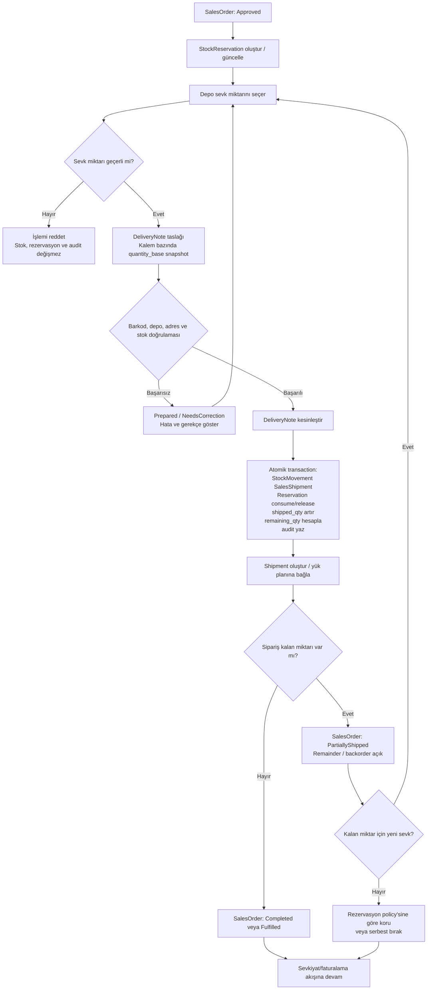
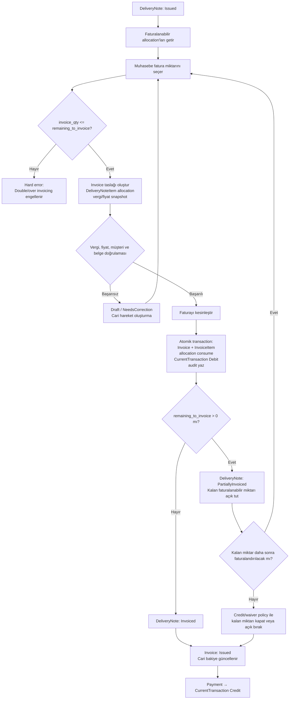
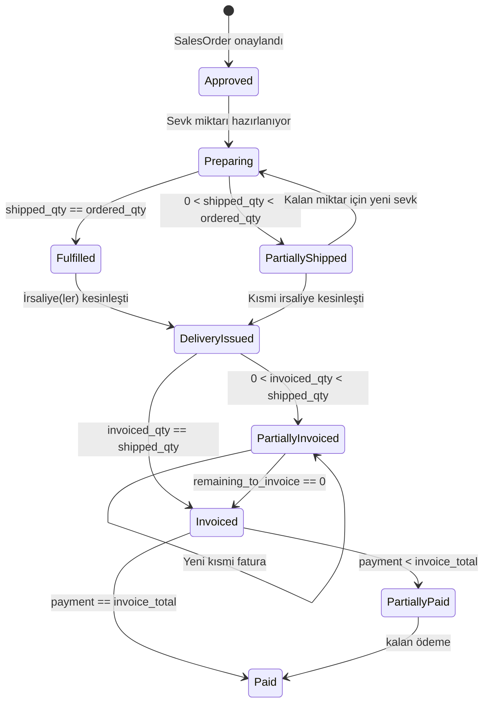

# Factory ERP — O-002/O-003 Kısmi Sevkiyat ve Kısmi Fatura İş Akışı

**Kapsam:** O-002 Kısmi sevkiyat ve O-003 kısmi fatura
**Durum:** Tasarım önerisi; karar sahibi onayı olmadan `DECIDED` değildir.
**İlgili akış:** `SalesOrder → StockReservation → DeliveryNote → Shipment → Invoice → CurrentAccount`

## 1. Tasarım yaklaşımı

Bu tasarımda kısmi sevkiyat ve kısmi fatura birbirinden bağımsız miktar akışları olarak ele alınır. Sipariş kaleminin sipariş edilen, rezerve edilen, sevk edilen ve kalan miktarları ayrı tutulur. İrsaliye kaleminin ise sevk edilen, faturalanan ve faturalanabilir kalan miktarları ayrı tutulur.

> **Önemli ayrım:** Kısmi sevkiyat, stok ve sipariş miktarlarını etkiler. Kısmi fatura, daha önce sevk edilmiş ve irsaliyeye bağlanmış miktarın cari hesapta borçlandırılmasını etkiler. Fatura oluşturmak tekrar stok çıkışı üretmez.

Bu belge, çözüm matrisindeki önerilen MVP davranışını diyagramlaştırır: kısmi sevkiyata ve kısmi faturaya izin verilir; hard quantity kontrolü, idempotency, allocation ve audit zorunludur.

## 2. Ortak miktar sözleşmesi

| Alan | Kaynak | Anlam | Değişim noktası |
|---|---|---|---|
| `ordered_qty` | `SalesOrderItem` | Müşterinin sipariş ettiği miktar | Sipariş revizyonu veya iptal politikası |
| `reserved_qty` | `StockReservation` | Sipariş için ayrılmış fakat henüz tüketilmemiş miktar | Onay, irsaliye kesinleştirme, iptal |
| `shipped_qty` | `SalesOrderItem` / delivery allocation | Kesinleştirilmiş irsaliyelerle sevk edilen miktar | `DeliveryNote.Issued` |
| `remaining_qty` | Türetilmiş | `ordered_qty - shipped_qty - cancelled_qty` | Sevk/iptal sonrası |
| `invoiceable_qty` | İrsaliye allocation | Sevk edilmiş ve henüz faturalanmamış miktar | İrsaliye kesinleşince oluşur, fatura ile azalır |
| `invoiced_qty` | İrsaliye allocation | Faturaya bağlanmış miktar | `Invoice.Issued` |
| `remaining_to_invoice` | Türetilmiş | `shipped_qty - invoiced_qty` | Fatura/credit/reversal sonrası |

Miktarlar sistem içinde `quantity_base` ile hesaplanır. Kullanıcı koli/paket/palet görünümüyle giriş yapabilir; backend ambalaj snapshot’ı üzerinden temel miktarı yeniden hesaplar. Aynı allocation ikinci kez sevk veya fatura işlemine dönüştürülemez.

## 3. O-002 — Kısmi sevkiyat ana iş akışı



### O-002 aktör ve kontrol tablosu

| Aşama | Aktör | Permission | State etkisi | Stok etkisi | Finans etkisi | Audit |
|---|---|---|---|---|---|---|
| Sevk miktarı seçimi | Depo | `delivery-note.create` | `DeliveryNote.Draft` | Yok | Yok | Girilen miktar ve ambalaj görünümü |
| Doğrulama | Sistem/depo | `delivery-note.validate` | `Prepared` veya `NeedsCorrection` | Yok | Yok | Hata kodları ve doğrulama sonucu |
| İrsaliye kesinleştirme | Depo/yönetici | `delivery-note.issue` | `Issued` | `StockMovement(SalesShipment)`; rezervasyon tüketimi | O-001/O-003 politikasına göre henüz cari yok | Kesinleştiren, zaman, miktar, snapshot |
| Kısmi durum | Sistem | — | `SalesOrder.PartiallyShipped` | Kalan rezervasyon policy’ye göre korunur/serbest bırakılır | Yok | Kalan miktar ve sebep |
| Yeni kısmi sevk | Depo | `delivery-note.create` | Yeni `DeliveryNote.Draft` | Yeni irsaliye kesinleşince çıkar | Yok | Önceki irsaliye referansı |

### O-002 hata ve istisna dalları

| Durum | Sistem davranışı |
|---|---|
| Sevk miktarı `remaining_qty` değerini aşar | İşlem hard error ile reddedilir; stok ve rezervasyon değişmez. |
| Kullanılabilir stok veya rezervasyon yetersiz | Kesinleştirme yapılamaz; eksik miktar kullanıcıya gösterilir. |
| Aynı irsaliye tekrar kesinleştirilir | Idempotent sonuç döndürülür veya `AlreadyIssued` hatası verilir; ikinci stok hareketi oluşmaz. |
| Sipariş iptal/reddedilmiş | Yeni irsaliye oluşturulamaz. |
| Kısmi teslim sonrası kalan miktar | Sipariş `PartiallyShipped` kalır; kalan kalemler ve yeni sevk önerisi görünür. |
| Müşteri kısmi sevki kabul etmiyorsa | Sipariş/kalem policy ile bloke edilir; bu alt politika O-002 kararında ayrıca seçilmelidir. |
| Sevk sonrası iade veya reversal | İlk `StockMovement` silinmez; ters hareket ve audit üretilir. |

## 4. O-003 — Kısmi fatura ana iş akışı



### O-003 aktör ve kontrol tablosu

| Aşama | Aktör | Permission | State etkisi | Stok etkisi | Finans etkisi | Audit |
|---|---|---|---|---|---|---|
| Faturalanabilir miktar sorgusu | Muhasebe | `invoice.read` | Değişmez | Yok | Yok | Sorgu/correlation id |
| Fatura taslağı | Muhasebe | `invoice.create` | `Invoice.Draft` | Yok | Cari hareket yok | Fiyat, vergi, packaging snapshot |
| Allocation doğrulaması | Sistem | — | Draft veya correction | Yok | Cari hareket yok | Sevk edilen/faturalanan kalan miktar |
| Fatura kesinleştirme | Muhasebe/yönetici | `invoice.issue` | `Invoice.Issued` | Yok | `CurrentTransaction(Debit)` | Belge numarası, kullanıcı, tutar |
| Kısmi durum | Sistem | — | `DeliveryNote.PartiallyInvoiced` | Yok | Faturalanan tutar kadar cari borç | Kalan miktar |
| Tamamlanma | Sistem | — | `DeliveryNote.Invoiced` | Yok | Cari borç tamamlanır | Allocation kapanışı |
| Ödeme | Muhasebe | `payment.create` | `Invoice.PartiallyPaid/Paid` | Yok | `CurrentTransaction(Credit)` | Ödeme referansı ve allocation |

### O-003 hata ve istisna dalları

| Durum | Sistem davranışı |
|---|---|
| İrsaliye `Issued` değil | Fatura oluşturma engellenir; taslakta kaynak belge seçilemez. |
| Fatura miktarı faturalanabilir kalanı aşar | Hard error; mevcut invoice allocation ve cari hareket değişmez. |
| Aynı allocation ikinci kez seçilir | Unique/idempotency kontrolü ile engellenir. |
| Fatura taslağı iptal edilir | Cari hareket oluşturulmaz; allocation tüketilmez. |
| Kesin fatura iptali | Fatura fiziksel silinmez; iptal veya credit/reversal akışıyla ters cari hareket üretilir. |
| İrsaliyede kalan miktar faturalanmayacak | Kapanış policy’si seçilmelidir: açık bırakma, manuel kapatma, credit/waiver. |
| Fiyat/vergi değişikliği | İrsaliye ve siparişten gelen değerler sessizce değiştirilmez; fatura snapshot ve yetkili düzeltme/audit gerekir. |

## 5. Birleşik durum ve miktar diyagramı



Bu durum diyagramında `SalesOrder`, `DeliveryNote` ve `Invoice` tek bir ortak state alanı paylaşmaz. Siparişin kısmi sevk durumu, irsaliyenin kısmi fatura durumundan bağımsızdır. Örneğin sipariş tamamen sevk edilmiş (`Fulfilled`) fakat iki irsaliyenin yalnızca biri faturalanmış (`PartiallyInvoiced`) olabilir.

## 6. Önerilen transaction sınırları

### 6.1 Kısmi sevkiyat kesinleştirme

```text
Validate delivery quantity
→ Lock SalesOrderItem / StockReservation / Stock
→ Validate remaining and available quantities
→ Create DeliveryNoteItem allocation
→ Create StockMovement(SalesShipment)
→ Consume or release reservation
→ Increment shipped_qty
→ Recalculate remaining_qty and SalesOrder state
→ Write audit and idempotency result
→ Commit
```

Bu transaction başarısız olursa irsaliye kesinleşmiş, stok çıkmış veya sipariş miktarı artmış gibi kısmi bir sonuç bırakılmamalıdır.

### 6.2 Kısmi fatura kesinleştirme

```text
Validate invoice allocation
→ Lock DeliveryNoteItem allocation
→ Validate issued source and remaining_to_invoice
→ Create Invoice and InvoiceItems
→ Consume invoice allocation
→ Create CurrentTransaction(Debit)
→ Recalculate DeliveryNote and Invoice state
→ Write audit and idempotency result
→ Commit
```

Fatura kesinleştirme stok hareketi oluşturmaz. Cari borç yalnızca fatura kesinleştirildiğinde oluşur; fatura taslağı oluşturulması cari hareket üretmez.

## 7. Permission ve audit matrisi

| İşlem | Minimum permission | Gerekli audit bilgisi |
|---|---|---|
| Kısmi irsaliye taslağı | `delivery-note.create` | Sipariş, kalem, eski/yeni miktar, ambalaj görünümü |
| İrsaliye doğrulama | `delivery-note.validate` | Hata/uyarı kodu, stok ve rezervasyon sonucu |
| İrsaliye kesinleştirme | `delivery-note.issue` | Kullanıcı, zaman, belge numarası, quantity snapshot |
| Kısmi fatura taslağı | `invoice.create` | Kaynak irsaliye, allocation miktarı, fiyat/vergi snapshot |
| Fatura kesinleştirme | `invoice.issue` | Kullanıcı, belge numarası, toplam, cari transaction id |
| Kalan miktarı kapatma | `order.close-remainder` veya `invoice.close-remainder` | Gerekçe, yetkili kullanıcı, kapanan miktar |
| Reversal/credit | `delivery-note.reverse` / `invoice.reverse` | Kaynak belge, ters hareket, gerekçe ve onay |

## 8. Karar sahiplerinin onaylaması gereken noktalar

Bu diyagramlar önerilen MVP akışıdır. O-002 için satış/depo yöneticisi; O-003 için muhasebe aşağıdaki noktaları onaylamalıdır:

1. Kısmi sevkiyat her sipariş ve kalem için serbest mi, yoksa müşteri/ürün bazında kısıtlanacak mı?
2. Kısmi sevkiyatta kalan rezervasyon korunacak mı, otomatik serbest mi bırakılacak?
3. Kalan sipariş miktarı backorder olarak mı, açık sipariş kalemi olarak mı izlenecek?
4. Bir irsaliye birden fazla sevkiyat veya paket planına bağlanabilecek mi?
5. Aynı irsaliye birden fazla faturaya bölünecek mi?
6. Fatura kaynağı irsaliye mi, sipariş mi, teslim edilen gerçek miktar mı olacak?
7. İrsaliyede kalan faturalanabilir miktar hangi koşulda kapatılabilecek?
8. Kısmi fatura sonrası cari bakiye ve risk hesabı hangi snapshot üzerinden çalışacak?
9. İrsaliye/fatura iptalinde yalnızca reversal mı kullanılacak, yoksa yetkili cancel state’i de olacak mı?
10. Kısmi sevkiyat ve kısmi fatura raporlarında tarih, miktar ve durum hangi ana göre hesaplanacak?

## 9. Design Gate etkisi

O-002 ve O-003 kararları onaylandığında aşağıdaki artefact'lar aynı karar kaydıyla güncellenmelidir:

- `decision-log.md`
- `open-decisions-solution-matrix.md`
- `business-workflows.md`
- `domain-model.md`
- `database-technical-architecture.md`
- sipariş/irsaliye/fatura UI tasarım belgeleri
- architecture, implementation ve QA/security skill mirror’ları
- ilgili integration/E2E test senaryoları

Karar sahibi onayı olmadan bu belge `DECIDED` değildir ve Design Gate `BLOCKED` durumu korunur.
