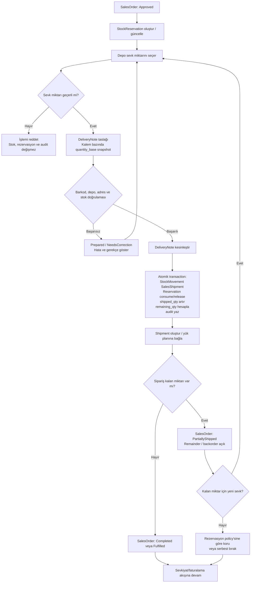
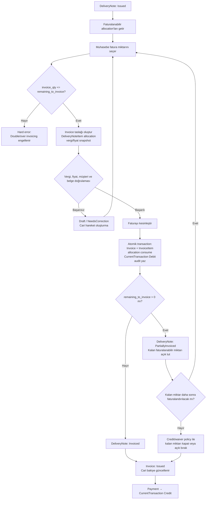
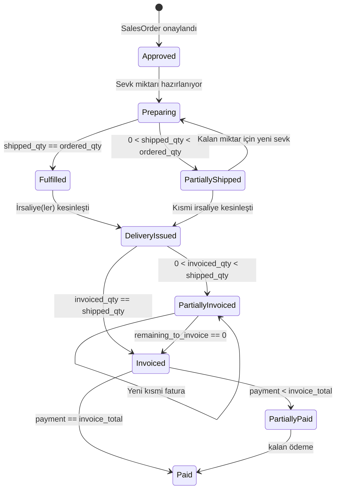

# Factory ERP — O-002/O-003 Kısmi Sevkiyat ve Kısmi Fatura İş Akışı

**Kapsam:** O-002 Kısmi sevkiyat ve O-003 kısmi fatura
**Durum:** Tasarım önerisi; karar sahibi onayı olmadan `DECIDED` değildir.
**İlgili akış:** `SalesOrder → StockReservation → DeliveryNote → Shipment → Invoice → CurrentAccount`
**Hata ve SQL eki:** [`quantity-error-handling-and-allocation-sql.md`](./quantity-error-handling-and-allocation-sql.md)

## 1. Tasarım yaklaşımı

Bu tasarımda kısmi sevkiyat ve kısmi fatura birbirinden bağımsız miktar akışları olarak ele alınır. Sipariş kaleminin sipariş edilen, rezerve edilen, sevk edilen ve kalan miktarları ayrı tutulur. İrsaliye kaleminin ise sevk edilen, faturalanan ve faturalanabilir kalan miktarları ayrı tutulur.

> **Önemli ayrım:** Kısmi sevkiyat, stok ve sipariş miktarlarını etkiler. Kısmi fatura, daha önce sevk edilmiş ve irsaliyeye bağlanmış miktarın cari hesapta borçlandırılmasını etkiler. Fatura oluşturmak tekrar stok çıkışı üretmez.

Bu belge, çözüm matrisindeki önerilen MVP davranışını diyagramlaştırır: kısmi sevkiyata ve kısmi faturaya izin verilir; hard quantity kontrolü, idempotency, allocation ve audit zorunludur.

## 2. Ortak miktar sözleşmesi

| Alan | Kaynak | Anlam | Değişim noktası |
|---|---|---|---|
| `ordered_qty` | `SalesOrderItem` | Müşterinin sipariş ettiği miktar | Sipariş revizyonu veya iptal politikası |
| `reserved_qty` | `StockReservation` | Sipariş için ayrılmış fakat henüz tüketilmemiş miktar | Onay, irsaliye kesinleştirme, iptal |
| `shipped_qty` | `SalesOrderItem` / delivery allocation | Kesinleştirilmiş irsaliyelerle sevk edilen miktar | `DeliveryNote.Issued` |
| `remaining_qty` | Türetilmiş | `ordered_qty - shipped_qty - cancelled_qty` | Sevk/iptal sonrası |
| `invoiceable_qty` | İrsaliye allocation | Sevk edilmiş ve henüz faturalanmamış miktar | İrsaliye kesinleşince oluşur, fatura ile azalır |
| `invoiced_qty` | İrsaliye allocation | Faturaya bağlanmış miktar | `Invoice.Issued` |
| `remaining_to_invoice` | Türetilmiş | `shipped_qty - invoiced_qty` | Fatura/credit/reversal sonrası |

Miktarlar sistem içinde `quantity_base` ile hesaplanır. Kullanıcı koli/paket/palet görünümüyle giriş yapabilir; backend ambalaj snapshot’ı üzerinden temel miktarı yeniden hesaplar. Aynı allocation ikinci kez sevk veya fatura işlemine dönüştürülemez.

### 2.1 Miktar alanlarının teknik sözleşmesi

Her işlem miktarı, kullanıcı girişini, hesaplanan temel miktarı ve işlem anındaki ambalaj tanımını birlikte taşır. `quantity_base` doğruluk kaynağıdır; kullanıcıya gösterilen ambalaj değeri hesap sonucunun yerine geçmez.

| Alan | Tip/öneri | Zorunluluk | Kaynak veya kural |
|---|---|---:|---|
| `entered_quantity` | `numeric(18,6)` | Evet | Kullanıcının seçtiği ambalaj seviyesindeki miktar |
| `entered_packaging_id` | UUID | Evet | Kullanıcının işlem seviyesinde seçtiği `ProductPackaging` |
| `quantity_base` | `numeric(18,6)` | Evet | Backend hesabı; `entered_quantity × quantity_in_base_uom` |
| `base_uom_id` | UUID | Evet | Ürün ana kaydından alınır; işlem snapshot’ında da saklanır |
| `quantity_operation_id` | UUID | İşleme göre | Count/transfer/delivery/invoice allocation’ın hangi operasyon miktarına ait olduğunu belirtir |
| `packaging_snapshot` | JSONB | Evet | İsim, seviye, katsayı, UOM, boyut/ağırlık ve effective version |
| `quantity_operation_snapshot` | JSONB | Commit’te | İşlem anındaki girilen/görünen/hesaplanan miktarların değişmez kopyası |
| `view_mode_at_entry` | Enum | Mobil işlemlerde | `BaseUnit`, `Packaging` veya `Breakdown`; ledger miktarını değiştirmez |
| `allocation_source_type` | Enum | Allocation’da | `SalesOrderItem` veya `DeliveryNoteItem` |
| `allocation_source_id` | UUID | Allocation’da | Kaynak kalemin kimliği |
| `idempotency_key` | String/UUID | Commit endpoint’inde | Aynı istemin ikinci hareket üretmesini engeller |

Frontend’den gelen `quantity_base`, `display` veya `packaging_snapshot` doğruluk kaynağı olarak kabul edilmez. Backend, `entered_packaging_id` için ürünün geçerli packaging version’ını bulur, katsayıyı yeniden hesaplar ve gönderilen temel miktar farklıysa işlemi reddeder veya server sonucunu kullanır. Önerilen MVP davranışı, kesinleştirme endpoint’inde tutarsız temel miktarı `QUANTITY_BASE_MISMATCH` ile reddetmektir.

### 2.2 Kaynak kayıt ve türetilmiş miktar kuralları

`SalesOrderItem` ve `DeliveryNoteItem` üzerinde özet alanların bulunması sorgu performansı için kabul edilebilir; ancak bu alanlar allocation ve ledger kayıtlarıyla aynı transaction içinde güncellenen kontrollü projection değerleridir. Tek doğruluk kaynağı olarak serbestçe düzenlenemezler.

```text
remaining_order_qty
  = ordered_qty - shipped_qty - cancelled_qty

available_to_ship_qty
  = min(remaining_order_qty, available_stock_for_order_qty)

reserved_open_qty
  = max(0, reserved_qty - shipped_qty - released_qty)

shipped_qty
  = Σ active DeliveryNoteItemAllocation.quantity_base

invoice_allocated_qty
  = Σ active InvoiceItemAllocation.quantity_base

remaining_to_invoice
  = shipped_qty - invoice_allocated_qty - waived_qty
```

Bütün değerler aynı ürün, depo, sipariş kalemi ve temel UOM bağlamında hesaplanır. `remaining_order_qty`, `reserved_open_qty` veya `remaining_to_invoice` negatif olamaz. Kısmi fatura için varsayılan öneri `waived_qty = 0` değerini korumaktır; faturalanmayan miktarın kapatılması ayrıca yetkili bir close/waiver işlemiyle yapılmalıdır.

Aşağıdaki eşitsizlikler her kesinleştirme öncesi server-side doğrulanır:

```text
0 ≤ shipped_qty ≤ ordered_qty - cancelled_qty
0 ≤ reserved_open_qty ≤ remaining_order_qty
0 ≤ new_shipment_qty ≤ remaining_order_qty
0 ≤ new_shipment_qty ≤ available_to_ship_qty
0 ≤ invoice_allocated_qty ≤ shipped_qty
0 ≤ new_invoice_qty ≤ remaining_to_invoice
```

### 2.3 Allocation modeli

Kısmi işlemler doğrudan belge toplamını azaltarak değil, kaynak kalem ile hedef belge arasındaki allocation kayıtlarıyla yönetilir.

| Allocation | Kaynak | Hedef | Commit olayı | İzin verilen toplam |
|---|---|---|---|---:|
| `DeliveryNoteItemAllocation` | `SalesOrderItem` | `DeliveryNoteItem` | `DeliveryNote.Issued` | `ordered_qty - cancelled_qty` |
| `InvoiceItemAllocation` | `DeliveryNoteItem` | `InvoiceItem` | `Invoice.Issued` | `DeliveryNoteItem.shipped_qty` |
| `PaymentAllocation` | `Invoice` veya current account | `Payment` | `Payment.Applied` | Açık cari/fatura bakiyesi |

Her allocation kaydında `source_id`, `target_id`, `quantity_base`, ambalaj snapshot’ı, oluşturulma zamanı, aktör, idempotency key ve gerekiyorsa reversal/credit referansı bulunur. Aynı kaynak kalem ile aynı hedef belge arasında duplicate allocation unique constraint ile engellenir. Bir kaynağın toplam aktif allocation’ı üst sınırı aşarsa transaction rollback edilir.

Allocation oluşturma taslak aşamasında yalnızca preview olabilir. Stok, rezervasyon veya cari hareketi yalnızca ilgili belge kesinleştirme transaction’ı üretir. Bu nedenle taslakta değiştirilen miktarların yeniden hesaplanması güvenlidir; kesinleşmiş allocation doğrudan edit edilmez, reversal veya düzeltme akışı kullanılır.

### 2.4 Ambalaj, kırılım ve precision kuralları

`quantity_base` için ürünün temel UOM’ına uygun precision tanımlanmalıdır. Adetle takip edilen ürünlerde temel miktar genellikle tam sayı, kg/metre/litre gibi ürünlerde ise ürün politikasının izin verdiği ondalık hassasiyettedir. Finansal tutarlar miktardan ayrı olarak currency precision ile yuvarlanır.

| Durum | Kural |
|---|---|
| Kapalı koli/paket | `allow_partial = false` ise yalnızca tam ambalaj miktarı kabul edilir. |
| Açılmış koli/paket | `allow_partial = true` ise kırılım satırlarıyla temel miktar girilebilir. |
| Palet/koli/paket görünümü | Sadece giriş ve görüntüleme biçimidir; ledger ve allocation `quantity_base` ile tutulur. |
| Ambalaj katsayısı değişikliği | Eski işlem snapshot’ı korunur; yeni effective version ile yeni işlem açılır. |
| Ondalık miktar | Ürünün UOM precision kuralını aşarsa `QUANTITY_PRECISION_EXCEEDED` döner. |
| Fatura tutarı | Satır ve belge yuvarlama kuralı O-001 ile birlikte uygulanır; miktar yuvarlamasıyla karıştırılmaz. |
| Mixed packaging | `4 Koli + 6 Paket` gibi kırılımın toplamı backend’de temel miktara çevrilir ve tek allocation olarak veya açık breakdown satırlarıyla saklanır. |

### 2.5 Miktar örneği

Bir sipariş kaleminde 10 koli ve her kolide 2.000 adet bulunduğu varsayılsın:

| Olay | `quantity_base` | Sipariş durumu |
|---|---:|---|
| Sipariş | 20.000 adet | `ordered_qty = 20.000`, `shipped_qty = 0`, `remaining_qty = 20.000` |
| İlk irsaliye | 6 koli = 12.000 adet | `shipped_qty = 12.000`, `remaining_qty = 8.000`, `PartiallyShipped` |
| İkinci irsaliye | 4 koli = 8.000 adet | `shipped_qty = 20.000`, `remaining_qty = 0`, `Fulfilled` |
| İlk fatura | 5.000 adet | `invoice_allocated_qty = 5.000`, `remaining_to_invoice = 15.000`, `PartiallyInvoiced` |
| İkinci fatura | 15.000 adet | `invoice_allocated_qty = 20.000`, `remaining_to_invoice = 0`, `Invoiced` |

Kullanıcı ikinci faturayı `7,5 Koli` olarak görse bile sistem bunu ilgili packaging katsayısı ile temel miktara çevirir; kapalı koli `allow_partial = false` ise bu giriş reddedilir veya `7 Koli + 1000 adet` gibi izin verilen kırılım istenir.

## 3. O-002 — Kısmi sevkiyat ana iş akışı



### O-002 aktör ve kontrol tablosu

| Aşama | Aktör | Permission | State etkisi | Stok etkisi | Finans etkisi | Audit |
|---|---|---|---|---|---|---|
| Sevk miktarı seçimi | Depo | `delivery-note.create` | `DeliveryNote.Draft` | Yok | Yok | Girilen miktar ve ambalaj görünümü |
| Doğrulama | Sistem/depo | `delivery-note.validate` | `Prepared` veya `NeedsCorrection` | Yok | Yok | Hata kodları ve doğrulama sonucu |
| İrsaliye kesinleştirme | Depo/yönetici | `delivery-note.issue` | `Issued` | `StockMovement(SalesShipment)`; rezervasyon tüketimi | O-001/O-003 politikasına göre henüz cari yok | Kesinleştiren, zaman, miktar, snapshot |
| Kısmi durum | Sistem | — | `SalesOrder.PartiallyShipped` | Kalan rezervasyon policy’ye göre korunur/serbest bırakılır | Yok | Kalan miktar ve sebep |
| Yeni kısmi sevk | Depo | `delivery-note.create` | Yeni `DeliveryNote.Draft` | Yeni irsaliye kesinleşince çıkar | Yok | Önceki irsaliye referansı |

### O-002 hata ve istisna dalları

| Durum | Sistem davranışı |
|---|---|
| Sevk miktarı `remaining_qty` değerini aşar | İşlem hard error ile reddedilir; stok ve rezervasyon değişmez. |
| Kullanılabilir stok veya rezervasyon yetersiz | Kesinleştirme yapılamaz; eksik miktar kullanıcıya gösterilir. |
| Aynı irsaliye tekrar kesinleştirilir | Idempotent sonuç döndürülür veya `AlreadyIssued` hatası verilir; ikinci stok hareketi oluşmaz. |
| Sipariş iptal/reddedilmiş | Yeni irsaliye oluşturulamaz. |
| Kısmi teslim sonrası kalan miktar | Sipariş `PartiallyShipped` kalır; kalan kalemler ve yeni sevk önerisi görünür. |
| Müşteri kısmi sevki kabul etmiyorsa | Sipariş/kalem policy ile bloke edilir; bu alt politika O-002 kararında ayrıca seçilmelidir. |
| Sevk sonrası iade veya reversal | İlk `StockMovement` silinmez; ters hareket ve audit üretilir. |

## 4. O-003 — Kısmi fatura ana iş akışı



### O-003 aktör ve kontrol tablosu

| Aşama | Aktör | Permission | State etkisi | Stok etkisi | Finans etkisi | Audit |
|---|---|---|---|---|---|---|
| Faturalanabilir miktar sorgusu | Muhasebe | `invoice.read` | Değişmez | Yok | Yok | Sorgu/correlation id |
| Fatura taslağı | Muhasebe | `invoice.create` | `Invoice.Draft` | Yok | Cari hareket yok | Fiyat, vergi, packaging snapshot |
| Allocation doğrulaması | Sistem | — | Draft veya correction | Yok | Cari hareket yok | Sevk edilen/faturalanan kalan miktar |
| Fatura kesinleştirme | Muhasebe/yönetici | `invoice.issue` | `Invoice.Issued` | Yok | `CurrentTransaction(Debit)` | Belge numarası, kullanıcı, tutar |
| Kısmi durum | Sistem | — | `DeliveryNote.PartiallyInvoiced` | Yok | Faturalanan tutar kadar cari borç | Kalan miktar |
| Tamamlanma | Sistem | — | `DeliveryNote.Invoiced` | Yok | Cari borç tamamlanır | Allocation kapanışı |
| Ödeme | Muhasebe | `payment.create` | `Invoice.PartiallyPaid/Paid` | Yok | `CurrentTransaction(Credit)` | Ödeme referansı ve allocation |

### O-003 hata ve istisna dalları

| Durum | Sistem davranışı |
|---|---|
| İrsaliye `Issued` değil | Fatura oluşturma engellenir; taslakta kaynak belge seçilemez. |
| Fatura miktarı faturalanabilir kalanı aşar | Hard error; mevcut invoice allocation ve cari hareket değişmez. |
| Aynı allocation ikinci kez seçilir | Unique/idempotency kontrolü ile engellenir. |
| Fatura taslağı iptal edilir | Cari hareket oluşturulmaz; allocation tüketilmez. |
| Kesin fatura iptali | Fatura fiziksel silinmez; iptal veya credit/reversal akışıyla ters cari hareket üretilir. |
| İrsaliyede kalan miktar faturalanmayacak | Kapanış policy’si seçilmelidir: açık bırakma, manuel kapatma, credit/waiver. |
| Fiyat/vergi değişikliği | İrsaliye ve siparişten gelen değerler sessizce değiştirilmez; fatura snapshot ve yetkili düzeltme/audit gerekir. |

## 5. Birleşik durum ve miktar diyagramı



Bu durum diyagramında `SalesOrder`, `DeliveryNote` ve `Invoice` tek bir ortak state alanı paylaşmaz. Siparişin kısmi sevk durumu, irsaliyenin kısmi fatura durumundan bağımsızdır. Örneğin sipariş tamamen sevk edilmiş (`Fulfilled`) fakat iki irsaliyenin yalnızca biri faturalanmış (`PartiallyInvoiced`) olabilir.

## 6. Önerilen transaction sınırları

### 6.1 Kısmi sevkiyat kesinleştirme

```text
Validate delivery quantity
→ Lock SalesOrderItem / StockReservation / Stock
→ Validate remaining and available quantities
→ Create DeliveryNoteItem allocation
→ Create StockMovement(SalesShipment)
→ Consume or release reservation
→ Increment shipped_qty
→ Recalculate remaining_qty and SalesOrder state
→ Write audit and idempotency result
→ Commit
```

Bu transaction başarısız olursa irsaliye kesinleşmiş, stok çıkmış veya sipariş miktarı artmış gibi kısmi bir sonuç bırakılmamalıdır.

### 6.2 Kısmi fatura kesinleştirme

```text
Validate invoice allocation
→ Lock DeliveryNoteItem allocation
→ Validate issued source and remaining_to_invoice
→ Create Invoice and InvoiceItems
→ Consume invoice allocation
→ Create CurrentTransaction(Debit)
→ Recalculate DeliveryNote and Invoice state
→ Write audit and idempotency result
→ Commit
```

Fatura kesinleştirme stok hareketi oluşturmaz. Cari borç yalnızca fatura kesinleştirildiğinde oluşur; fatura taslağı oluşturulması cari hareket üretmez.

## 7. State transition sözleşmesi

O-002 ve O-003 için belge state’leri birbirinden ayrıdır. `SalesOrder`, `DeliveryNote` ve `Invoice` kendi yaşam döngüsünü yönetir; bir belgenin state’i diğer belgenin state alanına doğrudan yazılmaz. İlişkili use-case başarılı olduğunda kaynak belge için kontrollü aggregate transition çalışır.

### 7.1 SalesOrder ve SalesOrderItem

| Mevcut state | Olay | Guard | Yeni state | Yan etkiler |
|---|---|---|---|---|
| `Draft` | `SubmitForApproval` | Zorunlu müşteri, kalem, miktar, adres ve fiyat snapshot tamam | `PendingApproval` | Approval task/audit |
| `PendingApproval` | `Approve` | Yetki, risk/override ve sipariş doğrulaması geçerli | `Approved` | Reservation create/update |
| `PendingApproval` | `Reject` | Ret gerekçesi | `Rejected` | Reservation yok/varsa release |
| `Approved` | `PrepareShipment` | Kalan miktar > 0, teslimat mümkün | `Preparing` | DeliveryNote draft açılabilir |
| `Preparing` | `IssuePartialShipment` | Yeni sevk miktarı tüm hard quantity kontrollerinden geçer ve `0 < shipped < ordered-cancelled` | `PartiallyShipped` | Delivery allocation, stock movement, reservation consume/release |
| `Preparing` veya `PartiallyShipped` | `IssueFinalShipment` | `remaining_order_qty = 0` | `Fulfilled` veya `Completed` | Son allocation ve state projection |
| `PartiallyShipped` | `CancelRemainder` | Yetkili rol, gerekçe, kalan miktar açık | `CompletedWithRemainderCancelled` | `cancelled_qty` artar, açık reservation release |
| `Approved`/`Preparing`/`PartiallyShipped` | `CancelOrder` | Sevk edilmiş miktar yok veya reversal policy izin veriyor | `Cancelled` | Açık reservation release |
| `Fulfilled`/`Completed` | `ReverseShipment` | Reversal/return yetkisi ve kaynak belge | `Exception` veya policy state | Ters stock movement; shipped projection yeniden hesaplanır |

`SalesOrderItem` state’i satır bazında `Open`, `PartiallyShipped`, `Fulfilled`, `Cancelled` veya `ClosedWithRemainder` olabilir. Sipariş üst state’i satırların aggregate durumundan türetilir. Bir siparişin bazı kalemleri tamamlanmış, bazıları kısmi sevk edilmişse sipariş `PartiallyShipped` olarak kalır.

### 7.2 DeliveryNote ve DeliveryNoteItem

| Mevcut state | Olay | Guard | Yeni state | Yan etkiler |
|---|---|---|---|---|
| `Draft` | `Prepare` | Kaynak sipariş onaylı, miktar > 0 | `Prepared` | Base quantity preview, paket/ambalaj snapshot |
| `Prepared` | `Validate` | Barkod, depo, adres, stock/reservation ve quantity guard geçerli | `ReadyToIssue` | Validation result |
| `Prepared`/`ReadyToIssue` | `Correct` | Kesinleşmemiş belge | Aynı state | Taslak miktar yeniden hesaplanır |
| `ReadyToIssue` | `Issue` | Permission, concurrency lock, tüm item allocation guard’ları geçerli | `Issued` | StockMovement, reservation update, order shipped projection |
| `Issued` | `CreateShipment` | Paket/rota/araç kuralları geçerli | `Shipped` veya shipment bağımsız state | Shipment reference |
| `Issued` | `Reverse` | Reversal yetkisi, teslim/finans policy’si uygun | `Reversed` veya `Exception` | Ters stok hareketi, audit |
| `Issued` | `Close` | Kalan quantity policy ile kapatılmış | `Closed` | Açık kalan miktar için close/waiver kaydı |

`DeliveryNoteItem` kesinleştikten sonra miktarı doğrudan edit edilemez. Yanlış miktar için taslak aşamasında düzeltme, kesinleşmiş belgede ise reversal ve yeni irsaliye/adjustment akışı uygulanır. `DeliveryNote` üst state’i bütün kalemlerin state ve remaining allocation durumundan türetilir; tek bir kısmi kalem varsa belge `PartiallyShipped`/`IssuedWithRemainder` benzeri rapor durumu taşıyabilir.

### 7.3 Invoice ve InvoiceItem

| Mevcut state | Olay | Guard | Yeni state | Yan etkiler |
|---|---|---|---|---|
| `Draft` | `Validate` | Kaynak irsaliye `Issued`, invoice allocation miktarı kalan miktarı aşmıyor | `ReadyToIssue` | Vergi/fiyat/document validation |
| `Draft`/`ReadyToIssue` | `Correct` | Cari hareket henüz yok | Aynı state | Allocation taslağı yeniden hesaplanır |
| `ReadyToIssue` | `Issue` | Permission, document sequence, concurrency ve allocation guard geçerli | `Issued` | Invoice allocation consume, CurrentTransaction Debit |
| `Issued` | `ApplyPayment` | Payment idempotency ve açık bakiye > 0 | `PartiallyPaid` veya `Paid` | CurrentTransaction Credit |
| `Issued`/`PartiallyPaid` | `Reverse` | Reversal/credit permission ve gerekçe | `Reversed` veya `Credited` | Ters cari transaction, active allocation yeniden hesaplanır |
| `Draft` | `CancelDraft` | Cari hareket ve belge numarası policy’ye göre henüz kesinleşmemiş | `Cancelled` | Allocation tüketilmez |

`InvoiceItem` miktarı `DeliveryNoteItem` üzerinde kalan aktif faturalanabilir miktarı aşamaz. `Invoice.Issued` sonrasında satır miktarı, fiyat, vergi ve kaynak allocation doğrudan değiştirilemez. Düzeltme, iptal/credit/reversal belgeleriyle gerçekleştirilir.

### 7.4 Geçişlerin aggregate ve transaction kuralı

State transition, miktar projection ve audit tek transaction içinde ele alınır. Örneğin `IssuePartialShipment` yalnızca `SalesOrder.state = PartiallyShipped` yazıp stok hareketi üretmeden başarılı sayılamaz; `IssueInvoice` de yalnızca `Invoice.Issued` yazıp cari transaction oluşturmadan başarılı sayılamaz.

```text
Command
→ Permission + state guard
→ Row/application lock
→ Re-read current quantity projection
→ Validate allocation upper bound
→ Write source/target allocation
→ Write stock or current-account ledger if required
→ Recalculate line and aggregate state
→ Write audit + idempotency result
→ Commit
```

### 7.5 Geçersiz state geçişleri

| Geçersiz işlem | Reddetme nedeni |
|---|---|
| `Draft → Issued` sipariş approval olmadan | Onaysız sipariş sevk edilemez. |
| `Rejected/Cancelled → Approved` | Yeni sipariş/yeniden açma policy’si olmadan eski kayıt canlandırılamaz. |
| `Approved → Fulfilled` sevk allocation olmadan | Sipariş tamamlanması fiziksel sevk kanıtı olmadan yapılamaz. |
| `DeliveryNote.Prepared → Invoice.Issued` | İrsaliye kesinleşmeden faturalanabilir miktar oluşmaz. |
| `Invoice.Draft → Paid` | Kesinleşmemiş fatura cari borç üretemez. |
| `Issued → Draft` | Kesinleşmiş belge geriye dönük edit edilemez; reversal gerekir. |
| `PartiallyInvoiced → Invoiced` kalan allocation kapanmadan | Kalan miktar faturalandırılmalı veya yetkili close/waiver kaydı oluşturulmalı. |
| Yeni shipment/invoice miktarı üst sınırı aşarken commit | Concurrency ve allocation guard ihlalidir; rollback gerekir. |
| Aynı idempotency key ile farklı payload gönderme | `IDEMPOTENCY_PAYLOAD_MISMATCH` döndürülür; ikinci işlem yapılmaz. |

### 7.6 Idempotency ve concurrency sözleşmesi

Kısmi sevk ve kısmi fatura kesinleştirme komutları `Idempotency-Key` ile gönderilir. Key, tenant/company, endpoint, actor ve payload hash bağlamında unique tutulur. Aynı key ve aynı payload tekrar gelirse ilk commit sonucu döndürülür. Aynı key farklı miktar, kaynak veya hedef allocation ile gelirse işlem reddedilir.

Kapasite/stok veya fatura allocation yarışında son yazan kazanmaz. Transaction kaynak kalemi kilitler, güncel projection’ı yeniden okur ve üst sınır kontrolünü kilit altında tekrarlar. İki kullanıcı aynı kalan 600 adedi 400 + 400 olarak kesinleştirmeye çalışırsa yalnızca ilk geçerli transaction commit edilir; ikinci işlem `QUANTITY_CONCURRENCY_CONFLICT` veya güncel kalan miktarı içeren kontrollü hata döndürür.

## 8. Permission ve audit matrisi

| İşlem | Minimum permission | Gerekli audit bilgisi |
|---|---|---|
| Kısmi irsaliye taslağı | `delivery-note.create` | Sipariş, kalem, eski/yeni miktar, ambalaj görünümü |
| İrsaliye doğrulama | `delivery-note.validate` | Hata/uyarı kodu, stok ve rezervasyon sonucu |
| İrsaliye kesinleştirme | `delivery-note.issue` | Kullanıcı, zaman, belge numarası, quantity snapshot |
| Kısmi fatura taslağı | `invoice.create` | Kaynak irsaliye, allocation miktarı, fiyat/vergi snapshot |
| Fatura kesinleştirme | `invoice.issue` | Kullanıcı, belge numarası, toplam, cari transaction id |
| Kalan miktarı kapatma | `order.close-remainder` veya `invoice.close-remainder` | Gerekçe, yetkili kullanıcı, kapanan miktar |
| Reversal/credit | `delivery-note.reverse` / `invoice.reverse` | Kaynak belge, ters hareket, gerekçe ve onay |

## 8. Karar sahiplerinin onaylaması gereken noktalar

Bu diyagramlar önerilen MVP akışıdır. O-002 için satış/depo yöneticisi; O-003 için muhasebe aşağıdaki noktaları onaylamalıdır:

1. Kısmi sevkiyat her sipariş ve kalem için serbest mi, yoksa müşteri/ürün bazında kısıtlanacak mı?
2. Kısmi sevkiyatta kalan rezervasyon korunacak mı, otomatik serbest mi bırakılacak?
3. Kalan sipariş miktarı backorder olarak mı, açık sipariş kalemi olarak mı izlenecek?
4. Bir irsaliye birden fazla sevkiyat veya paket planına bağlanabilecek mi?
5. Aynı irsaliye birden fazla faturaya bölünecek mi?
6. Fatura kaynağı irsaliye mi, sipariş mi, teslim edilen gerçek miktar mı olacak?
7. İrsaliyede kalan faturalanabilir miktar hangi koşulda kapatılabilecek?
8. Kısmi fatura sonrası cari bakiye ve risk hesabı hangi snapshot üzerinden çalışacak?
9. İrsaliye/fatura iptalinde yalnızca reversal mı kullanılacak, yoksa yetkili cancel state’i de olacak mı?
10. Kısmi sevkiyat ve kısmi fatura raporlarında tarih, miktar ve durum hangi ana göre hesaplanacak?

## 9. Design Gate etkisi

O-002 ve O-003 kararları onaylandığında aşağıdaki artefact'lar aynı karar kaydıyla güncellenmelidir:

- `decision-log.md`
- `open-decisions-solution-matrix.md`
- `business-workflows.md`
- `domain-model.md`
- `database-technical-architecture.md`
- sipariş/irsaliye/fatura UI tasarım belgeleri
- architecture, implementation ve QA/security skill mirror’ları
- ilgili integration/E2E test senaryoları

Karar sahibi onayı olmadan bu belge `DECIDED` değildir ve Design Gate `BLOCKED` durumu korunur.
