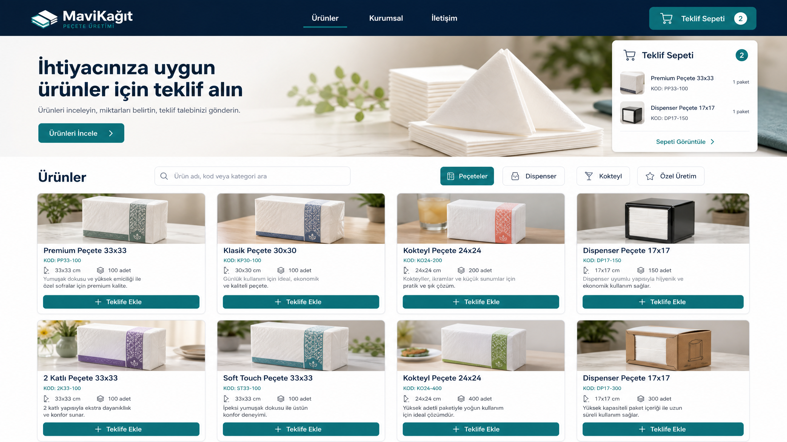
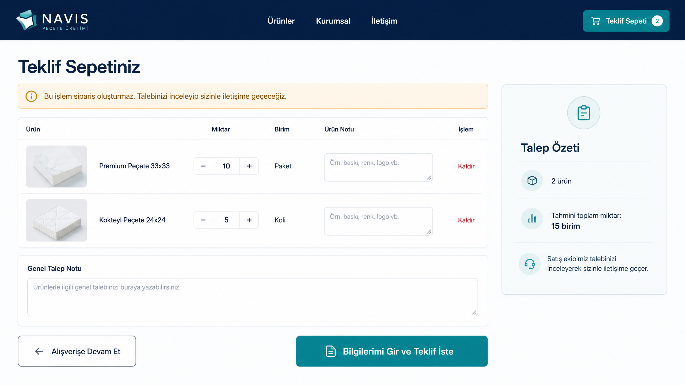
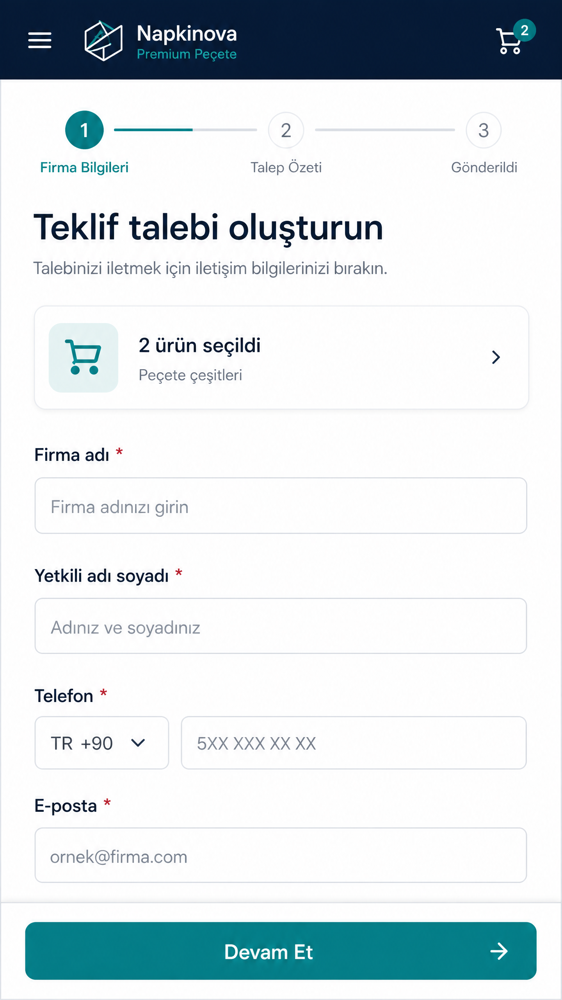

# Public Ürün Kataloğu ve Teklif Sepeti
## Detaylı Arayüz Tasarım Teslimi

## 1. Tasarım hedefi

Bu bölüm, şirket dışındaki müşterinin ürünleri görmesine, ürünleri teklif sepetine eklemesine, miktar ve özel not belirtmesine ve iletişim bilgilerini bırakarak teklif talebi oluşturmasına odaklanır. Akış bir e-ticaret ödeme süreci değildir; kullanıcıya her adımda bunun bir **teklif talebi** olduğu açıkça anlatılır.

> Tasarımın ana mesajı: **Ürünleri seçin, ihtiyacınızı belirtin, şirketimizden teklif alın.**

## 2. Ekran seti

| Ekran | Amaç | Ana işlem |
|---|---|---|
| Public ana sayfa | Ziyaretçiyi katalog ve teklif sürecine yönlendirmek | Ürünleri İncele |
| Ürün kataloğu | Ürünleri aramak, filtrelemek ve keşfetmek | Teklife Ekle |
| Ürün detay | Ürünün özelliklerini ve paket bilgisini incelemek | Miktar seçip eklemek |
| Teklif sepeti | Ürünleri, miktarları ve notları kontrol etmek | Bilgilerimi Gir ve Teklif İste |
| Firma bilgileri | İletişim bilgilerini almak | Devam Et |
| Talep özeti | Gönderim öncesi son kontrol | Teklif Talebini Gönder |
| Başarılı gönderim | Talep numarasını göstermek | Kataloğa Dön |

## 3. Public ana sayfa

Üst navigasyonda logo, Ürünler, Kurumsal, İletişim ve rozetli Teklif Sepeti bulunur. Hero alanında “İhtiyacınıza uygun ürünler için teklif alın” başlığı, kısa açıklama ve “Ürünleri İncele” butonu yer alır. Öne çıkan kategoriler ve ürün kartları ana sayfada hızlı keşif sağlar.

Ana sayfa ziyaretçiye üç adımlı süreci de anlatır: **Ürünleri seçin → Miktar belirtin → Talebinizi gönderin.** Bu anlatım, ziyaretçinin katalogda ürün seçmesinin doğrudan sipariş veya ödeme oluşturmadığını önceden açıklar.

## 4. Ürün kataloğu

### Masaüstü yerleşimi

```text
[Logo]  Ürünler  Kurumsal  İletişim                  [Teklif Sepeti 2]

Ürünler
İhtiyacınız olan ürünleri seçerek teklif talebi oluşturabilirsiniz.

[Ürün adı, kod veya kategori ara]
[Peçeteler] [Dispenser] [Kokteyl] [Özel Üretim]    Sıralama: Önerilen

[Ürün Kartı] [Ürün Kartı] [Ürün Kartı] [Ürün Kartı]
[Ürün Kartı] [Ürün Kartı] [Ürün Kartı] [Ürün Kartı]
```

### Ürün kartı

Kartta ürün fotoğrafı, ürün adı, ürün kodu, ölçü, paket/koli bilgisi, kısa açıklama ve “Teklife Ekle” butonu bulunur. Public kullanıcıya stok miktarı, maliyet veya şirket içi fiyat gösterilmez. Fiyat yerine gerektiğinde “Teklif isteyin” açıklaması kullanılabilir.

Ürün daha önce sepete eklendiyse kart üzerindeki birincil işlem “Sepette” veya “Miktarı Güncelle” durumuna geçebilir. Aynı ürün ikinci kez eklenirse yeni satır oluşturulmaz; mevcut satırın miktarı artırılır.

### Filtreler

| Filtre | Örnek değerler |
|---|---|
| Kategori | Peçeteler, Dispenser, Kokteyl, Özel Üretim |
| Ölçü | 17x17, 24x24, 30x30, 33x33, 40x40 |
| Paket içeriği | 50, 100, 150, 200 adet |
| Sıralama | Önerilen, ürün adına göre, yeni ürünler |

## 5. Ürün detay ekranı

Ürün detay ekranı büyük ürün görseli ve teknik bilgi alanlarını yan yana gösterir. Bilgi alanında ürün adı, ürün kodu, ölçü, paket içeriği, koli içeriği, birim ve açıklama bulunur.

Miktar alanı ürünün birimiyle birlikte gösterilir. Örneğin `10 Paket` veya `5 Koli`. Kullanıcı ürün notuna baskı, renk, özel ambalaj veya kullanım amacı gibi ayrıntıları yazabilir.

```text
[← Ürünlere Dön]

[ Büyük ürün görseli ]     Premium Peçete 33x33
                           Ürün Kodu: ÜRÜN-001
                           Ölçü: 33x33 cm
                           Paket içeriği: 100 adet
                           Koli içeriği: 20 paket
                           Ürün açıklaması

                           Miktar [-] [10] [+] [Paket]
                           Ürün notu [________________]
                           [Teklife Ekle]
```

## 6. Teklif sepeti

Sepet başlığında “Teklif Sepetiniz” yazısı ve şu açıklama bulunur:

> **Bu işlem sipariş oluşturmaz.** Talebinizi inceleyip sizinle iletişime geçeceğiz.

Masaüstünde ürün satırları tablo biçiminde, mobilde dikey kart biçiminde gösterilir. Her satırda ürün fotoğrafı, ürün adı, miktar kontrolü, birim, ürün notu ve kaldırma işlemi bulunur.

```text
Ürün                         Miktar       Birim       Ürün Notu       İşlem
Premium Peçete 33x33         [- 10 +]     Paket       [not alanı]      Kaldır
Kokteyl Peçete 24x24         [- 5 +]      Koli        [not alanı]      Kaldır

Genel Talep Notu
[Ürünlerle ilgili genel talebinizi buraya yazabilirsiniz.]

[Alışverişe Devam Et]          [Bilgilerimi Gir ve Teklif İste]
```

Sağ tarafta “Talep Özeti” kartı bulunur. Bu kartta seçilen ürün sayısı, toplam kalem/miktar özeti ve satış ekibinin dönüş yapacağına dair güven metni gösterilir. Para toplamı gösterilmez.

## 7. Firma bilgileri formu

Form iki aşamalıdır. İlk aşama yalnızca teklif talebini işleme alabilmek için gereken bilgileri sorar:

| Alan | Zorunluluk | Örnek / doğrulama |
|---|---|---|
| Firma adı | Zorunlu | Firma adı boş bırakılamaz |
| Yetkili adı soyadı | Zorunlu | En az ad ve soyad |
| Telefon | Zorunlu | Türkiye telefon formatı |
| E-posta | Zorunlu | Geçerli e-posta formatı |

İkinci aşamada seçilen ürünler, miktarlar, ürün notları, genel talep notu ve gizlilik/iletişim onayı gösterilir. Kullanıcı göndermeden önce “Bilgileri Düzenle” ile ilk adıma dönebilir.

## 8. Başarı ve hata durumları

### Başarı

Başarılı gönderim ekranında `Teklif talebiniz alındı` başlığı, `TLT-2026-000184` örneğinde olduğu gibi talep numarası, gönderim tarihi ve şirket satış ekibinin iletişime geçeceği açıklaması bulunur.

### Hata

Gönderim başarısız olursa girilen bilgiler silinmez. Kullanıcıya “Talep gönderilemedi. Bilgileriniz korunuyor; lütfen tekrar deneyin.” açıklaması ve “Tekrar Dene” butonu gösterilir.

### Boş sepet

Boş sepette “Henüz ürün eklemediniz” açıklaması ve “Kataloğa Git” butonu görünür. Sepet sayfasında form veya teklif gönder butonu gösterilmez.

## 9. Mobil uyarlama

Mobil üst barda hamburger menü, şirket logosu ve sepet ikonu bulunur. Ürün kartları tek sütun olur. Filtreler bottom sheet olarak açılır. Ürün detayında “Teklife Ekle” butonu ekranın altına sabitlenir.

Teklif formunda üç aşamalı ilerleme göstergesi kullanılır:

```text
1 Firma Bilgileri  →  2 Talep Özeti  →  3 Gönderildi
```

Form alanları büyük dokunma hedefleriyle tasarlanır. “Devam Et” butonu ekranın altında sabit kalır; klavye açıldığında buton form alanlarının üzerine binmez.

## 10. İç ERP bağlantısı

Public form gönderildikten sonra şirket içi sistemde `NEW` durumunda yeni bir Teklif Talebi oluşur. Satış kullanıcısına “Yeni teklif talebi geldi” bildirimi gönderilir. Talep detayında firma, yetkili, telefon, e-posta, seçilen ürünler, miktarlar ve notlar eksiksiz korunur.

## 11. Görsel mockup'lar







## 12. Onaylanmış görsel yön

Görsel dilde derin lacivert üst navigasyon, açık arka plan, teal birincil CTA, sade ürün fotoğraf kartları ve düşük görsel gürültü tercih edilmiştir. Public taraf iç ERP'ye göre daha sıcak ve ürün odaklıdır; ancak aynı renk ailesi ve durum dili korunarak şirket içi sistemle marka bütünlüğü sağlanır.

## 13. Sonraki tasarım adımı

Bu ekranlardan sonra aynı public görsel sistemle ürün detay ekranının yüksek çözünürlüklü versiyonu, boş sepet, form doğrulama hataları ve başarılı gönderim ekranı hazırlanabilir. Tasarım onayından sonra bu sayfalar için route listesi ve component listesi çıkarılarak frontend implementasyonuna geçilebilir.
