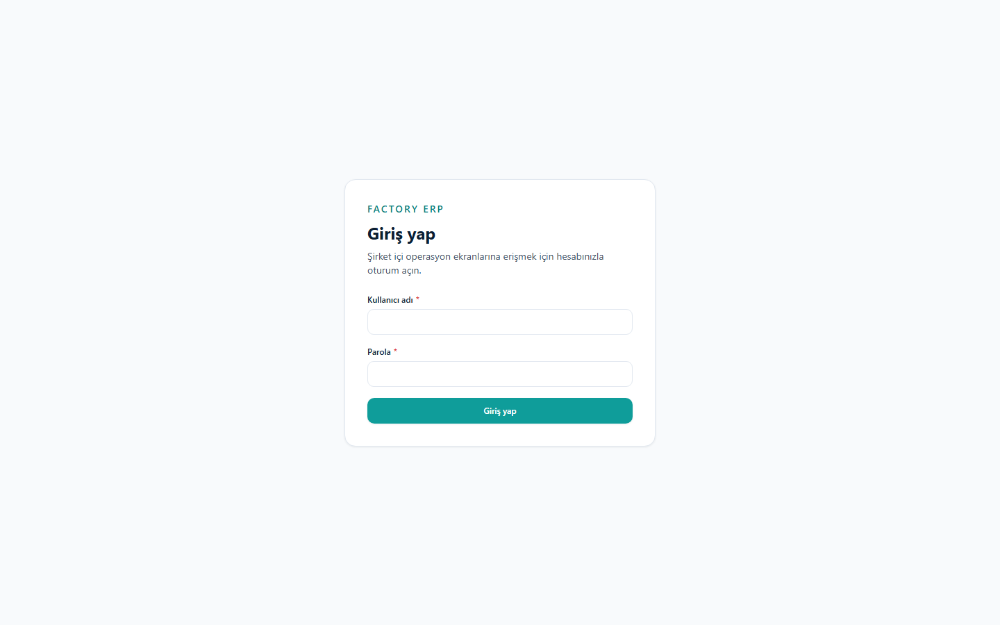
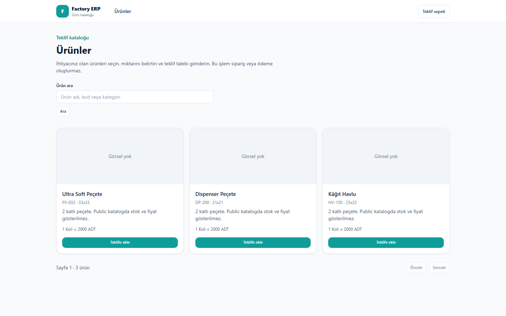
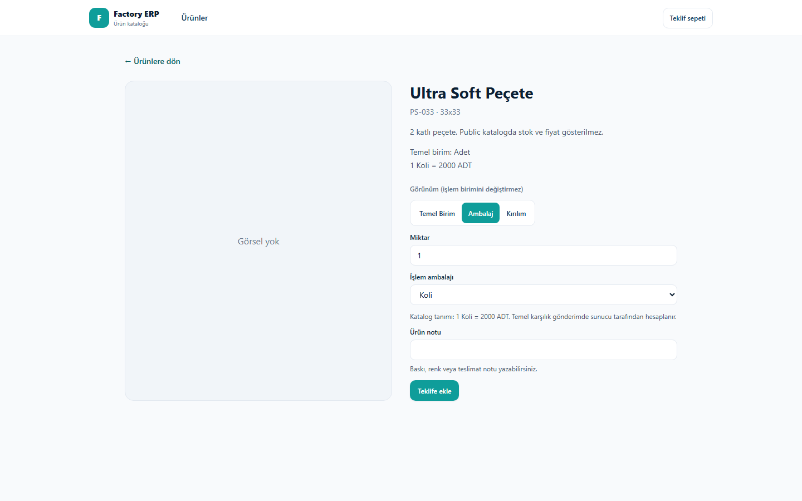
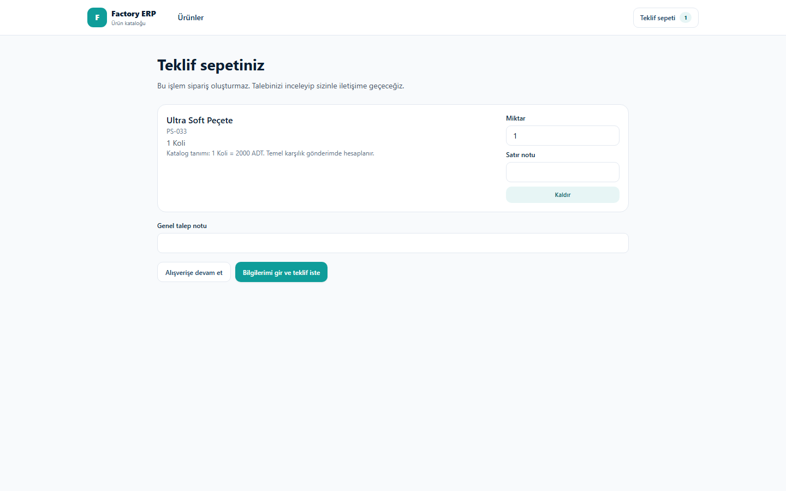
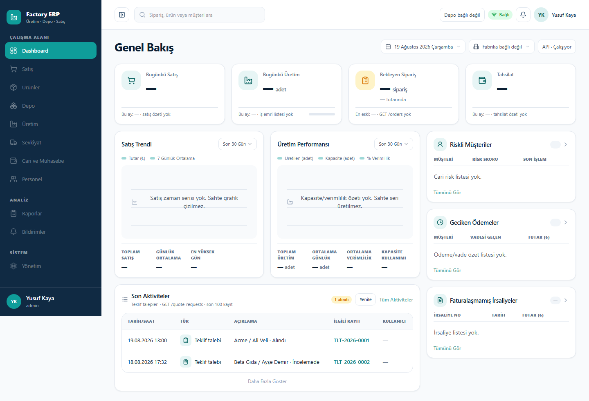
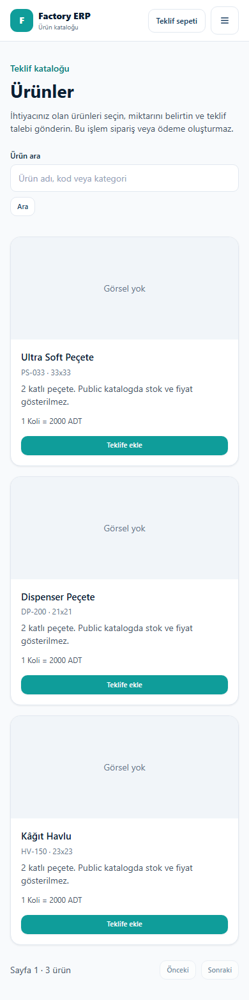
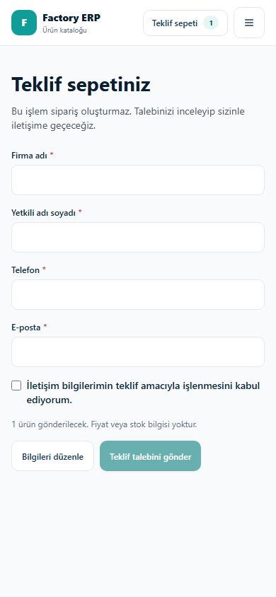
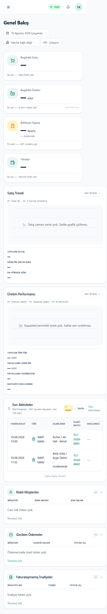

# Implemented UI — Fihrist

Kodlanan web ekranlarının 2026-08-19 tarihli ekran görüntüleri. Referans mockup’lar `docs/05-assets/mockups/` altındadır. Bu klasör **çalışan arayüzün** kaydıdır; tasarım PNG’lerinin kopyası değildir.

Yeniden çekmek: Next.js `http://localhost:3000` açıkken `node docs/05-assets/implemented-ui/capture.mjs` (Playwright gerekir).

| No | Dosya | Ekran | Route | Viewport | Referans mockup |
|---:|---|---|---|---|---|
| 01 | [01-giris-desktop.png](./01-giris-desktop.png) | Giriş | `/giris` | 1440×900 | (ayrı mockup yok; WEB 003) |
| 02 | [02-katalog-desktop.png](./02-katalog-desktop.png) | Public katalog listesi | `/katalog` | 1440×900 | `uretim-depo-public-catalog-desktop-mockup.png` |
| 03 | [03-katalog-urun-desktop.png](./03-katalog-urun-desktop.png) | Ürün detay + miktar/ambalaj | `/katalog/[slug]` | 1440×900 | `uretim-depo-product-catalog-mockup.png` |
| 04 | [04-katalog-sepet-desktop.png](./04-katalog-sepet-desktop.png) | Teklif sepeti | `/katalog/sepet` | 1440×900 | `uretim-depo-quote-cart-desktop-mockup.png` |
| 05 | [05-dashboard-desktop.png](./05-dashboard-desktop.png) | Genel Bakış | `/dashboard` | 1440×900 | `uretim-depo-erp-dashboard-reference.png` |
| 06 | [06-katalog-mobile.png](./06-katalog-mobile.png) | Public katalog (telefon) | `/katalog` | 390×844 | public katalog + mobile yoğunluk |
| 07 | [07-katalog-teklif-form-mobile.png](./07-katalog-teklif-form-mobile.png) | Teklif iletişim formu | `/katalog/sepet` | 390×844 | `uretim-depo-quote-form-mobile-mockup.png` |
| 08 | [08-dashboard-mobile.png](./08-dashboard-mobile.png) | Genel Bakış (telefon) | `/dashboard` | 390×844 | dashboard mockup, tek kolon |

## Görsel özet

### 01 — Giriş

### 02 — Public katalog

### 03 — Ürün detay

### 04 — Teklif sepeti

### 05 — Dashboard Genel Bakış

### 06 — Katalog mobil

### 07 — Teklif formu mobil

### 08 — Dashboard mobil

## Referansta olup henüz kodlanmayan ekranlar

Bu klasörde fotoğraf yok; mockup `docs/05-assets/mockups/` içinde duruyor.

| Mockup | Durum |
|---|---|
| `uretim-depo-order-detail-mockup.png` | WEB 006+ sipariş |
| `uretim-depo-production-work-order-mockup.png` | üretim iş emri |
| `uretim-depo-shipment-mockup.png` ve sevkiyat masaüstü seti | sevkiyat |
| `uretim-depo-accounting-current-account-mockup.png` | cari |
| `uretim-depo-hr-attendance-mockup.png` | personel |
| `uretim-depo-mobile-barcode-mockup.png` ve barkod akışı | native/mobile-web operasyon |
| `vehicle-detail-capacity-desktop.png` | araç kapasite |

## Çekim notu

Katalog ve dashboard görselleri, backend kapalıyken Playwright’ın BFF yanıtlarını taklit etmesiyle alındı. Dashboard KPI rakamları (`—`) sahte satış/üretim değildir; mockup kromu + gerçek teklif satırlarıdır.
